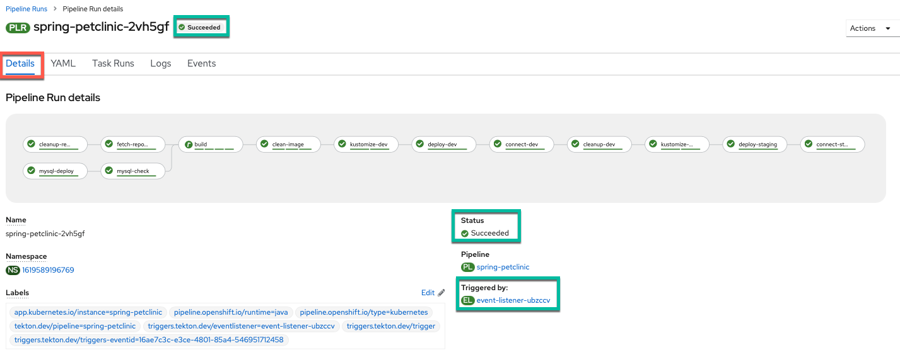

# CI/CD in Action

## Make a change in GitHub

1. Navigate to your GitHub fork's main page (this is the `Code` tab if you are on a different tab such as settings)

2. Choose to `Go to file`

    

3. Choose the following file (copy and paste box below image):

    

    ``` bash
    src/main/resources/db/mysql/data.sql
    ```

    !!! Tip "If the file doesn't appear right away"
        Depending on your internet connection to GitHub, there may be a slight delay before the file appears for editing (your screen matches the picture above and you can click to select the file).

4. Select to edit the file

    

5. Change the file to add the pet field of your choice and commit it to your GitHub fork (description and copy and paste box are below image)

    

    1. Make a change using the pet type you want to add (example is a turtle) 

        !!! note
            The copy and paste box below can be entered on **line 24** with `enter` pressed after it to match the image above.

        !!! example "Turtle"
            ``` mysql
            INSERT IGNORE INTO types VALUES (7, 'turtle');
            ```

        !!! Tip "I want to add Willow, an awesome armadillo, not Yertle the turtle!"
            If you want to add something other than a turtle as an option, please change `turtle` to that animal (i.e. `armadillo`) in the mysql statement above. For the armadillo example, the statement becomes:

            ```mysql
            INSERT IGNORE INTO types VALUES (7, 'armadillo');
            ```

    2. Type in a commit message (you can make this whatever you want) and commit the change (example from image below)

        !!! example "Yertle the turtle"

            **Title**
            ``` bash
            Turtle Time
            ```

            **Extended Description**
            ``` bash
            I want to be able to add Yertle the turtle.
            ```

6. Take note of the git commit message and hash

    

## Continuous Integration via OpenShift Pipelines

## Successfully Run Pipeline via GitHub
1. Visit the newly triggered pipeline run in the `Pipelines` menu in the OpenShift UI

    

2. View the pipeline run from the `Details` view

    

    You can see the event listener has triggered the `PipelineRun` instead of a user this time.

3. You can see the variables populated with the correct values from Github in the `YAML` view of the pipeline run.

    

4. Watch the results of your build pipeline run. It should complete successfully as in the pictures below. 

    !!! info "How long will your pipeline take to run?"
        The pipeline run may take anywhere from 10-25 minutes to complete depending on the current system load. You can see the progress of your build, as well as if any errors occur, via the UI. Thus, by monitoring the UI, you can make sure things are going as planned.

    !!! Tip "What to do if your pipeline run ends in failure"
        If your pipeline run ends in failure, please look at the `Failure` tab (immediately below this message) to get back on track (instead of the default `Success` tab).

    === "Success"
        **Pipeline Run Success View Perspective:**

        

        !!! Success "Pipeline Run Details View"
            In the pipeline run `Details` view, you can see the pipeline run succeeded with all tasks having a green check mark. Additionally, observe that the event listener has triggered the `PipelineRun` instead of a user this time.

        **Pipeline Run Success Logs Perspective:**

        

        !!! Success "Pipeline Run Logs View 1"
            In the pipeline run `Logs` view, you can also see that the pipeline run tasks all have green check marks. Looking at the last task, you can see that the that the external connection check worked and the PetClinic application is available at the route printed in the logs. Additionally, you can see via the series of tasks marked with green checks that the dev deployment ran successfully and the system cleaned it up and ran the staging deployment successfully to complete the pipeline.
            
        

        !!! Success "Pipeline Run Logs View 2"
            When you switch to the `deploy-staging` task logs, by clicking on the `task` on the left hand side of the `Logs` view of the pipeline run, you see this was an automated build from git since the task prints out the `GIT_MESSAGE` that you typed in your commit word for word. (_Note: If you chose a different commit message that will show instead of the one displayed in the image above._).

    === "Failure"
        !!! Failure "Your pipeline failed, here is how to get back on the happy path"
            1. Please review your `pipelineRun` and see what error caused the failure.

            2. Make changes to fix the error. (If it's unclear what is causing the error / how to fix it, please ask the instructors for help) 

            3. Resend the webhook from GitHub to trigger a new `pipelineRun` with the same values as before (see images below for help)

                1. Click on your webhook from the `Webhooks` section of the repository settings for your GitHub repository fork of the `spring-petclinic` repository
                

                2. Click on the 3 dots for the most recent delivery
                3. Click `Redeliver`
                

### See Changes in Application

1. Navigate to the `Topology` view and open a new tab with your recently deployed `staging` version of the PetClinic application by clicking `Open URL`.

    

2. Navigate to the `Find Owners` tab

     

3. Choose to add a new owner

    

4. Add the owner with details of your choice

    

5. Choose to add one of the owner's pets

    

6. Fill in the pet's details and select the new type of pet you added (turtle for the example)

    

7. View the newly created pet of the new type (Yertle the turtle for the example)

    

## Summary :full_moon_with_face:

In this section, you made a change to your PetClinic application to add a new pet type of your choice and pushed the change to GitHub. This triggered a new pipeline run which built a new image for the application tagged with the git commit hash and displayed the commit message explaining the change the build was implementing. Next, your pipeline deployed this change to OpenShift in development, tested it internally and externally and then rolled it out to staging (where it was also tested automatically). Finally, you visited the application and used the new feature (new type of pet) by adding a pet of that type to a new owner successfully. In other words, you are off the ground and running with "cloud native" CI/CD for your PetClinic application on IBM Z/LinuxONE! Congratulations!!!

--8<-- "includes/glossary.md"