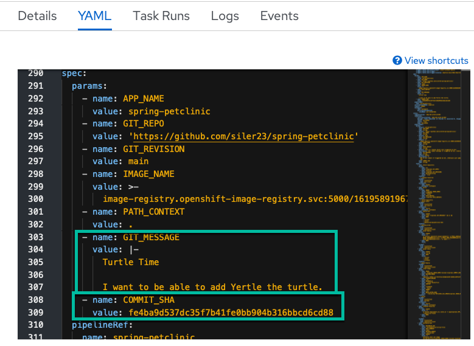

# Time to put it all in action for take 2

## Make a change in GitHub

1. Navigate to your GitHub fork

2. Choose to go to file

    

3. Choose a file such as the following:

    ``` bash
    src/main/resources/db/mysql/data.sql
    ```

4. Change the file

    

5. Commit the change to your GitHub fork

    

6. See the commit hash and message

    

## Continuous Integration via OpenShift Pipelines

1. View the newly triggered PipelineRun

    

    We can see the event listener has triggered the `PipelineRun` instead of a user this time.

2. We can see the variables populated with the correct values from Github

    

3. The PipelineRun successfully completes

    

:smile: