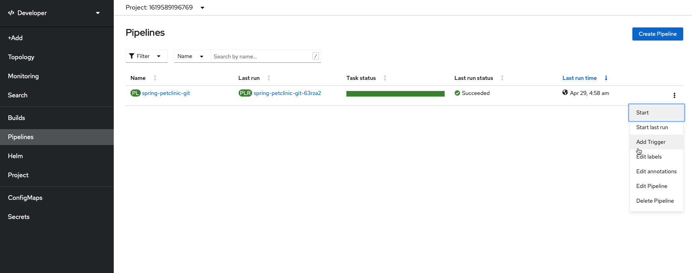

# Integrating OpenShift Pipelines with GitHub

## Add a GitHub Trigger

1. Choose add a GitHub Trigger from the pipeline menu

    

2. Choose the following parameters for the trigger (leaving others as default picture following)

    **Git Provider Type**:
    ``` bash
    github-push
    ```

    **GIT_MESSAGE**
    ``` bash
    $(tt.params.git-commit-message)
    ```

    **COMMIT_SHA**
    ``` bash
    $(tt.params.git-revision)
    ```

    **What this looks like:**

    

Now the git commit message as well and the SHA of the git commit will be passed to the build from the GIT webhook that triggers the build.

## Setting up Git Webhook

Now, we need to set up a webhook from GitHub. We want this to hit the `event listener` that the OpenShift Pipelines UI set up when we added a trigger. Luckily, we can easily get this trigger when we view our pipeline

1. Get event listener url from the pipeline view

    

    You need to get the value you have listed for your pipeline and copy that value.

2. Navigate to your Git fork of the `github.com/ibm-wsc/spring-petclinic` GitHub repository

3. Go to the `settings` page of the repository

4. Go to the Webhooks section and add a webhook with the `event listener URL` as the `PAYLOAD_URL` and `application/json` selected as the `Content type`

    

5. See the successfully create webhook now listed

    

## Summary

We created a GitHub Trigger for our pipeline, which is connected to a TriggerTemplate that will start our pipeline (passing it the git commit SHA hash and the commit message as well as other values we aren't using) when the ClusterTriggerBinding is triggered. Since we selected GitHub push as the ClusterTriggerBinding it will be activated on a push. In order to do the actual activation, we created a GitHub webhook that will reach out to the event listener URL when an action happens in GitHub. Thus, when we make a new GitHub change to our fork, we will start a new pipeline build. We will do this in the next section.