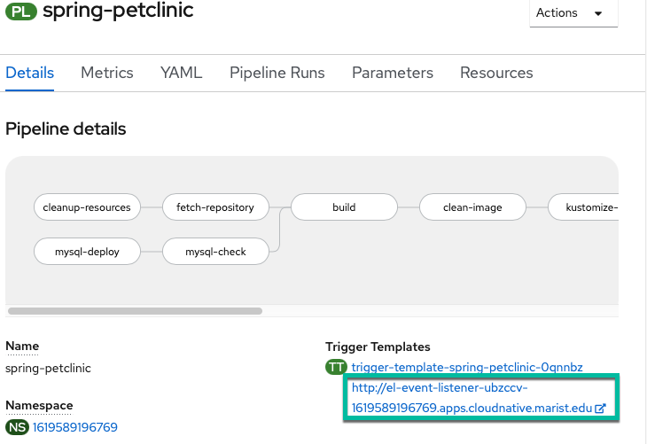

# Integrating OpenShift Pipelines with GitHub

It's time to add the `C` (continuous) to your CI/CD pipeline.

## Add a GitHub Trigger

1. Choose add a GitHub Trigger from the pipeline menu

    

2. Configure the trigger as follows (copy and paste boxes below image. Note: `github-push` is in a menu you need to select from):

    

    **Git Provider Type**:
    ``` bash
    github-push
    ```

    **GIT_MESSAGE**
    ``` bash
    $(tt.params.git-commit-message)
    ```

    **COMMIT_SHA**
    ``` bash
    $(tt.params.git-revision)
    ```

You are choosing the `github-push` cluster trigger binding, which is defined out of the box for OpenShift pipelines. This passes information into a number of different variables which you can list by clicking the expand arrow seen in the picture (It will initially say `Show Variables` and then switch to `Hide Variables` when expanded as shown in the picture). You will be using the variables boxed in the picture to pass the git commit message (`git-commit-message`) as well as the SHA of the git commit (`git-revision`) to the build from the GitHub webhook that triggers the build.

## Setting up Git Webhook

Now, you need to set up a webhook from GitHub. You want this to hit your `event listener`, the pipelines resource which listens for events from outside sources in order to trigger a build. The listener you set up is using the `github-push` trigger binding to trigger a new pipelinerun for your `spring-petclinic` pipeline passing the `github-push` parameters mentioned before. You created this `event-listener` via the OpenShift Pipelines UI when you added a trigger and will see it in the `Topology` section of the OpenShift UI as another application when you travel back there later. In order to setup your webhook to send a message to the `event listener` after a Github Push do the following:

1. Get event listener url from the pipeline view

    

    You need to get the value you have listed for your pipeline and copy that value.

2. Navigate to your Git fork of the `github.com/ibm-wsc/spring-petclinic` GitHub repository

3. Go to the `settings` page of the repository

4. Go to the Webhooks section and add a webhook with the `event listener URL` as the `PAYLOAD_URL`, `application/json` selected as the `Content type`, and `Just the push event` selected for `Which events would you like to trigger this webhook?`.

    

5. See the successfully create webhook now listed

    

## Summary

You created a GitHub webhook for your `spring-petclinic` repository fork that will trigger a new run of your `spring-petclinic` pipeline when new code is pushed to your GitHub repo[^1]. You will do this in the next section.

[^1]: A more detailed explanation is that when new code is pushed to your GitHub repo, the GitHub webhook will send a payload to the event listener which then interacts with a number of OpenShift Pipelines-associated Kubernetes custom resources that you created when you used the `Add Trigger` button in the UI. Namely, the event listener will trigger a new `PipelineRun` of your `spring-petclinic` pipeline based on the `spring-petclinic` `TriggerTemplate` passing it the values for the git commit SHA hash and the commit message using the variables populated via the `github-push` `ClusterTriggerBinding`.