# Automatically Testing and Promoting your Application

Here you will edit your pipeline to test your application in development, clean up your development resources, promote your application to staging, and test it in staging.

## Testing your Application in the Wild

During the build stage of your pipeline, you tested two things:

  1. That the pieces of your application worked (unit testing)
  2. That they worked together (integration testing)
  
Now, it's time to go a step further and automate testing that your application is working and accessible when deployed in a real (OpenShift) environment:

  1. Internally (within OpenShift)
  2. Externally (the outside world)

### Internally (Within Kubernetes/OpenShift)

The first thing you need to test is that the application is alive and available from within your cluster (Kubernetes environment). This is important not only for when running the CI/CD pipeline, but also for any time your application is running  (downtime is detrimental, especially in production). 

This functionality is available in Kubernetes via [probes](https://kubernetes.io/docs/tasks/configure-pod-container/configure-liveness-readiness-startup-probes/){target="_blank" rel="noopener noreferrer"}. There are 3 different types of probes to test the different aspects of your application's availability:

!!! info "Kubernetes Probes in Spring"
    In Spring there are built-in endpoints for Kubernetes probes. If you are interested in learning how to program these into a Spring application of yours in the future, please take a look at [Spring's official blog](https://spring.io/blog/2020/03/25/liveness-and-readiness-probes-with-spring-boot){target="_blank" rel="noopener noreferrer"}.

1. Startup probes:

    1. Activate first
    
    2. Make sure an application is up and running (started up) 
    
    3. Free startup concerns/constraints from other probes
    
    Here is the `startupProbe` for the container running the PetClinic application:

    ``` yaml
    startupProbe:
        httpGet:
        path: /actuator/health/liveness
        port: 8080
        periodSeconds: 10
        failureThreshold: 30
    ```

    It simply queries (via localhost) PetClinic's liveness health endpoint. Once this returns successfully, you can be confident the application has started up and can begin to monitor the liveness and readiness of each container of each replica (pod) of your application throughout its lifecycle.

2. Liveness probes:

    1. Make sure an application is actually running and not caught in a deadlock (it's alive)

    2. Restart "dead" containers automatically with [kubelet](https://kubernetes.io/docs/reference/command-line-tools-reference/kubelet/){target="_blank" rel="noopener noreferrer"}
    
    3. Fix problems that may arise in long-running containers via the aforementioned restart
    
    Here is the `livenessProbe` for the container running the PetClinic application:

      ``` yaml
      livenessProbe:
          httpGet:
          path: /actuator/health/liveness
          port: 8080
          periodSeconds: 10
          failureThreshold: 3
      ```

      This looks almost identical to the `startupProbe` above other than having a much lower `failureThreshold`. The `startupProbe` is making sure the container of a given pod of your application's deployment is alive when it first starts up (It is allowing time for that startup to occur). On the other hand, the `liveness` probe above is making sure your application stays alive throughout its lifecycle. Therefore, it has a much lower `failureThreshold` to enable [kubelet](https://kubernetes.io/docs/reference/command-line-tools-reference/kubelet/){target="_blank" rel="noopener noreferrer"} to quickly respond (restart the container) when the container becomes deadlocked.


3. Readiness probes:

    1. Check if each copy (replica) of an application is ready
    
    2. Makes sure traffic goes only to replicas that are ready for it
    
    3. Prevents users from interacting with unready replicas (getting unnecessary errors)
    
    Here is the `readinessProbe` for the container running PetClinic:

    ``` yaml
    readinessProbe:
        httpGet:
        path: /actuator/health/readiness
        port: 8080
        periodSeconds: 10
    ```

    It simply queries (via localhost) PetClinic's readiness health endpoint. This probe will let Kubernetes know when to send traffic to a PetClinic replica. When you send traffic to the application, only the available replicas will receive it. This means that replicas which aren't ready for traffic don't accidentally get it, preventing errors for the user.

These 3 probes serve to declare to Kubernetes the way your application (and the replicas that make it up) should behave, enabling the system to monitor and take action on your behalf (restarting the container or removing its pod's endpoint from service) when the current state (the status) does not meet the desired state (your specification).

The rollout task you created before as `deploy-dev` will only complete once all desired replicas are ready, implying that both the `startup` (initial liveness) and `readiness` probes have successfully passed and all replicas of your application are initially alive and ready for business. 


### Testing External Connections

While making sure your application is internally up and running is important, at the end of the day you want to provide access to your users externally[^1]. 

[^1]: 
    For different environments like dev and test, this may be different groups external to your Kubernetes environment (cluster), though internal to the organization itself and accessing the endpoints via a VPN or internal network. Production is likely when external connection via an organization's real website would happen. The type of external connection (via a VPN or public connection) has little impact on the Kubernetes resources given a route will be used for all of those types of external connections (the most important thing is that the route you are testing is available to you [the tester] from where you are).

This means it is important to also test the OpenShift route (the component providing the external connection) as part of your CI/CD pipeline to ensure it is correctly servicing web traffic external to your cluster[^2].

[^2]: 
    You may think to yourself that you can't test an external connection from inside your cluster. However, by using the route, you are causing the traffic to go "outside" the cluster's networking to reach the load balancer and then back "inside" via the route. This explicitly tests the external connection and makes sure that it indeed works. However, you are just testing that the route works, not that the dns/hostname is available generally on the internet or private enterprise subnet (depending on environment). Internet / subnet dns resolution is a different, more general problem for your networking team (or cloud provider) to ensure for all of the applications using that network.

#### Create External Route Test Task

You will create a task to check the connection to your external route as part of your CI/CD pipeline.

1. Copy the `connection-test` task using the following definition (copy by clicking on the copy icon in the top right of the box below):

    ``` yaml
    apiVersion: tekton.dev/v1beta1
    kind: Task
    metadata:
        name: connection-test
    spec:
        description: >-
          "This task runs a bash script to determine if a given application
          is accessible to the outside world via its route."
        params:
        - name: ROUTE_NAME
          default: ""
          description: "The name of the OpenShift route for the application."
          type: string
        - name: APP_PATH
          default: "/"
          description: "The path to reach the application from it's hostname"
          type: string
        - name: EXPECTED_STATUS
          default: "200"
          description: "The expected http(s) status code from querying the application."
          type: string
        - name: TIMEOUT
          default: "30"
          description: "The number of seconds to try before giving up on a successful connection."
          type: string
        - name: SECURE_CONNECTION
          default: "true"
          description: "true for a secure route (https), false for an insecure (http) route."
          type: string
        steps:
          - name: route-connection-test
            image: 'image-registry.openshift-image-registry.svc:5000/openshift/cli:latest'
            resources:
              limits:
                cpu: 200m
                memory: 200Mi
              requests:
                cpu: 200m
                memory: 200Mi
            script: |
                #!/usr/bin/env bash
                # Make parameters into variables for clarity
                export route_name="$(params.ROUTE_NAME)"
                export expected_status="$(params.EXPECTED_STATUS)"
                export app_path="$(params.APP_PATH)"
                export timeout="$(params.TIMEOUT)"
                export secure_connection="$(params.SECURE_CONNECTION)"

                # If true, http(s), if false (or otherwise) http
                if [ "${secure_connection}" == "true" ]
                then
                    export header="https://"
                    echo "Using secure https connection..."
                else
                    export header="http://"
                    echo "Using insecure http connection..."
                fi
                # Start timer at 0
                SECONDS=0
                # Once timeout reached, stop retrying
                while [ "${SECONDS}" -lt "${timeout}" ];
                do
                    # Get hostname of route
                    hostname="$(oc get route ${route_name} -o jsonpath='{.spec.host}')"
                    # Get http(s) status of web page via external connection (route)
                    status=$(curl -s -o /dev/null -w "%{http_code}" "${header}${hostname}${app_path}")
                    # Print test completion message if expected status code received
                    if [ "${status}" -eq "${expected_status}" ]
                    then
                        echo "---------------------------TESTS COMPLETE---------------------------"
                        echo "Congratulations on a successful test!"
                        echo "Please visit the application at:"
                        echo
                        echo "${header}${hostname}${app_path}"
                        exit 0
                    # Print failure message if incorrect status code received + retry
                    else
                        echo "The application is unexpectedly returning http(s) code ${status}..."
                        echo "It is not available to outside traffic yet..."
                        echo "Retrying in 5s at:"
                        echo
                        echo "${header}${hostname}${app_path}"
                        sleep 5
                    fi
                done
                # Redirect output to standard error, print message, and exit with error after timeout
                >&2 echo "Error, failed after ${timeout} seconds of trying..."
                >&2 echo "The application was never accessible to the outside world :("
                exit 1
    ```
2. Create the `connection-test` Task
    
    1. Click `Import YAML` to bring up the box where you can create Kubernetes resource definitions from yaml

    2. Paste the `connection-test` Task into the box
    
    3. Scroll down and click create to create the `connection-test` Task 

    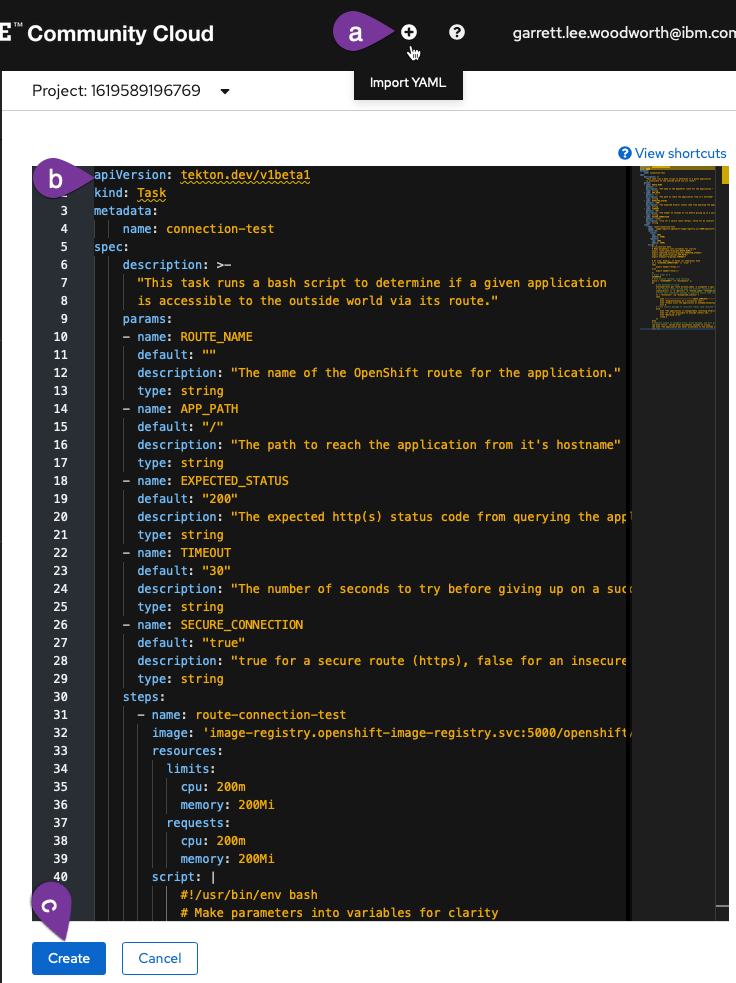

You should now see the created `connection-test` Task. Finally, navigate back to the `Pipelines` section of the OpenShift UI and go back to editing your pipeline.

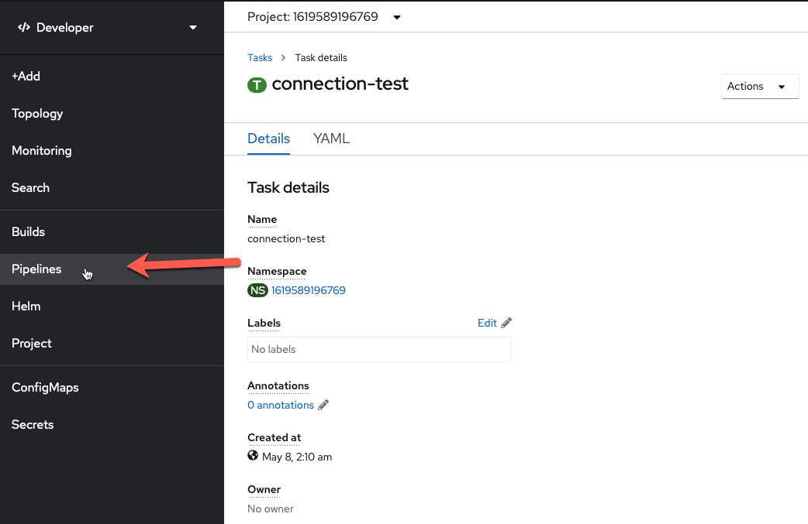

#### Add External Route Test Task to Pipeline

1. Add a sequential task after `deploy-dev`. When you `Select Task`, choose the `connection-test` task. 

    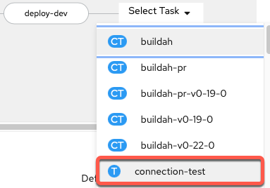

2. Configure `connection-test` task

    The only values you need to change are the `Display Name` and the `ROUTE_NAME` (copy and paste boxes below image):

    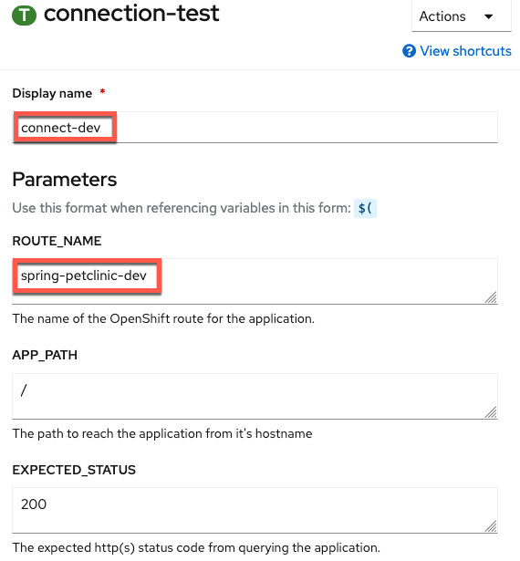

    ``` bash title="Display Name"
    connect-dev
    ```

    ``` bash title="ROUTE_NAME"
    spring-petclinic-dev
    ```

3. `Save` the pipeline

Your current pipeline builds and tests your application, creates a docker image for it, deploys it to the development environment, and ensures that the application is working both internally and externally. In other words, once your application successfully completes the current pipeline, you can be confident in it and be ready to move to staging[^3]. 

[^3]: 
    You could create more extensive tests to make sure that the pages are rendering correctly (besides just returning a proper status code). However, that is beyond the scope of the lab and this at least makes sure requests are successfully sent and returned via an external route, which is good enough for the lab's purposes.

## Deploy Staging 

Moving to the staging environment means spinning up your application in that environment (with parameters relevant for it) and testing it there. Given that this is all using containers, you can easily free up the development resources that have successfully completed and then spin up the new resources in your staging environment.

### Remove Dev

Your first Task will mirror the `cleanup-resources` task at the beginning of your pipeline, but will just cleanup the `dev` resources using the `env=dev` [label selector](https://kubernetes.io/docs/concepts/overview/working-with-objects/labels/#label-selectors){target="_blank" rel="noopener noreferrer"}.

1. Go back to editing your pipeline via `Actions -> Edit Pipeline`

    

2. Add a Task sequentially at the end of the pipeline (after `connect-dev`) using the `openshift-client` ClusterTask.  

    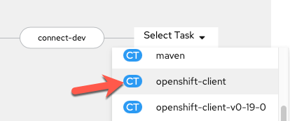

3. Configure the Task with the following values (copy and paste boxes below image):

    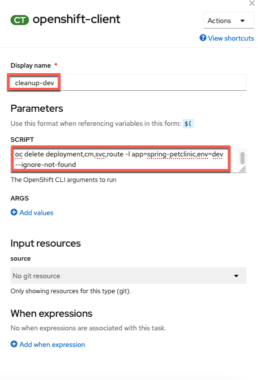

    ``` bash title="Display Name"
    cleanup-dev
    ```

    ``` bash title="SCRIPT"
    oc delete deployment,cm,svc,route -l app=spring-petclinic,env=dev --ignore-not-found
    ``` 

    and an **empty** `ARGS` value.

    !!! warning "No help please!"
        Make sure `help` is deleted from the `ARGS` section (click the - button to delete the default help args line). 

### Add Staging

You will use your existing `kustomize` task to deploy the staging configuration for your PetClinic application in a new `kustomize-staging` task. [Customizations for staging PetClinic](https://github.com/ibm-wsc/spring-petclinic/blob/main/ocp-files/overlay/staging/kustomization.yaml){target="_blank" rel="noopener noreferrer"} include adding a staging environment label, name suffix, change cause, and staging environment variables for your application. You could deploy to a separate project or cluster altogether as well as change replicas or add pod autoscalers in a similar manner (depending on your use case) for different environments. 

1. Add a `kustomize` task sequentially to the end of your current pipeline (after `cleanup-dev`)

    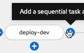 
    
2. Configure the Task with the following values (copy and paste boxes below image):

    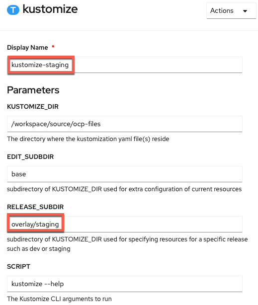

    ``` bash title="Display Name"
    kustomize-staging
    ```

    ``` bash title="RELEASE_SUBDIR"
    overlay/staging
    ```

    ``` bash title="SCRIPT"
    kustomize edit set image spring-petclinic=$(params.IMAGE_NAME)-minimal:$(params.COMMIT_SHA)
    ```

	``` bash title="SOURCE (choose from dropdown)"
	workspace
	```

### Rollout Staging

1. Edit the pipeline again and add a `deploy-staging` task with the `openshift-client` ClusterTask

    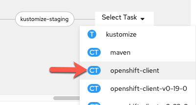

2. Configure the task with the following parameters[^4] (copy and paste boxes below image):
  
    [^4]: This mirrors the `dev-deploy` task which waits for the dev release to rollout but uses the `SCRIPT` field for everything vs. `ARGS`.

    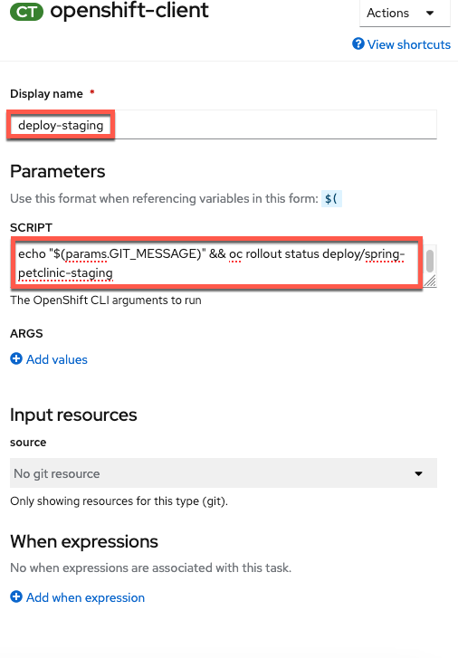

    ``` bash title="Display Name"
    deploy-staging
    ```

    ``` bash title="SCRIPT"
    echo "$(params.GIT_MESSAGE)" && oc rollout status deploy/spring-petclinic-staging
    ```

    !!! warning "No help please!"
        Make sure `help` is deleted from the `ARGS` section (click the - button to delete the default help args line).

### Add External Route Test Task to Pipeline

1. Add a sequential task after `deploy-staging`. When you `Select Task`, choose the `connection-test` task. 

    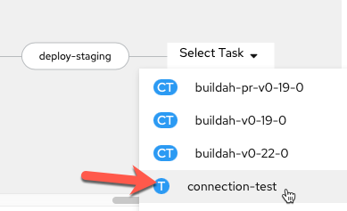

2. Configure `connection-test` task with the following parameters (copy and paste boxes below image):

    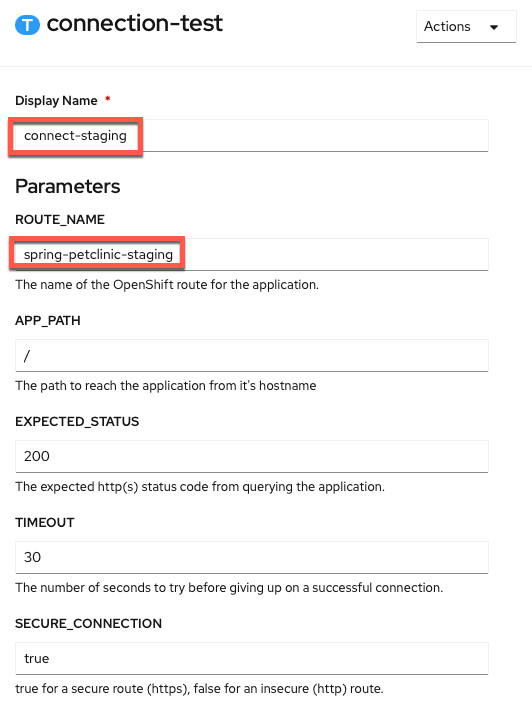

    ``` bash title="Display Name"
    connect-staging
    ```

    ``` bash title="ROUTE_NAME"
    spring-petclinic-staging
    ```

3. `Save` the pipeline

    

## Summary :waxing_gibbous_moon:

Congratulations! You have built a pipeline that tests your `PetClinic` application, creates a docker image for it, deploys it to the development environment with dev configuration, ensures that the application is working both internally and externally, cleans up the development environment, deploys it to the staging environment with staging configuration, and then makes sure it is working both internally and externally[^5]. 

!!! summary "tl;dr"
    You now have the `I/D` (Integration/Deployment) in `CI/CD`[^6].

[^5]:
  You could clean up the staging environment at the end of the run but choose not to so that the user can interact with it between runs. You could also clean up or use a separate MySQL instance for staging but due to limited resources in your environment you have chosen not to add this extra component.

[^6]: 
  You'll add the double `C`s in the next section by connecting it to GitHub.