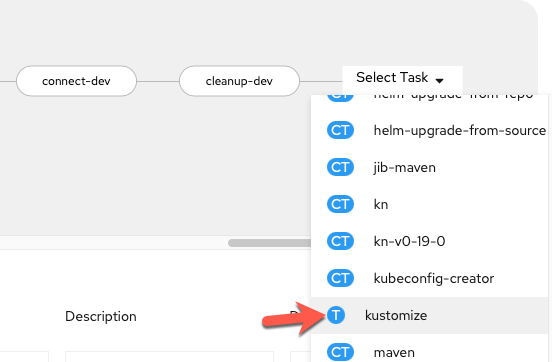

# From dev to staging

Here we will edit our pipeline to add steps to deploy the staging version of our application.

## How do I know my app is running

### Probes

Our app has the following probes defined via Kubernetes [see how to setup probes in the Kubernetes documentation](https://kubernetes.io/docs/tasks/configure-pod-container/configure-liveness-readiness-startup-probes/){target="_blank" rel="noopener noreferrer"}

3 types of probes. Startup probes activate at first to make sure an application is up and running.

``` yaml
startupProbe:
    httpGet:
    path: /actuator/health/liveness
    port: 8080
    periodSeconds: 10
    failureThreshold: 30
```

Liveness probes make sure an application is alive. If it's not it can restart it to fix problems that may arise in long-running containers.

``` yaml
livenessProbe:
    httpGet:
    path: /actuator/health/liveness
    port: 8080
    periodSeconds: 10
    failureThreshold: 3
```

Readiness probes check if an application is ready. When one replica of an application isn't ready, it can be taken out of the service so that traffic doesn't route to it, instead going to the other replicas.

```
readinessProbe:
    httpGet:
    path: /actuator/health/readiness
    port: 8080
    periodSeconds: 10
```

For more information on Kubernetes probes with spring boot see [Spring's official blog](https://spring.io/blog/2020/03/25/liveness-and-readiness-probes-with-spring-boot){target="_blank" rel="noopener noreferrer"}


``` yaml
apiVersion: tekton.dev/v1beta1
kind: Task
metadata:
    name: route-check
spec:
    description: >-
      "This task runs a bash script to determine if a given application
       is accessible to the outside world via its route."
    params:
    - name: ROUTE_NAME
      default: ""
      description: "The name of the OpenShift route for the application."
      type: string
    - name: APP_PATH
      default: "/"
      description: "The path to reach the application from it's hostname"
      type: string
    - name: EXPECTED_STATUS
      default: "200"
      description: "The expected http(s) status code from querying the application."
      type: string
    - name: TIMEOUT
      default: "30"
      description: "The number of seconds to try before giving up on a successful connection."
      type: string
    - name: SECURE_CONNECTION
      default: "true"
      description: "true for a secure route (https), false for an insecure (http) route."
      type: string
    steps:
      - name: check-route
        image: 'image-registry.openshift-image-registry.svc:5000/openshift/cli:latest'
        resources:
          limits:
            cpu: 200m
            memory: 200Mi
          requests:
            cpu: 200m
            memory: 200Mi
        script: |
            #!/usr/bin/env bash
            # Make parameters into variables for clarity
            export route_name="$(params.ROUTE_NAME)"
            export expected_status="$(params.EXPECTED_STATUS)"
            export app_path="$(params.APP_PATH)"
            export timeout="$(params.TIMEOUT)"

            # If true, http(s), if false (or otherwise) http
            if [ "${SECURE_CONNECTION}" == "true" ]
            then
                export header="https://"
            else
                export header="http://"
            fi
            # Start timer at 0
            SECONDS=0
            # Once timeout reached, stop retrying
            while [ "${SECONDS}" -lt "${timeout}" ];
            do
                # Get hostname of route
                hostname="$(oc get route ${route_name} -o jsonpath='{.spec.host}')"
                # Get http(s) status of web page via external connection (route)
                status=$(curl -s -o /dev/null -w "%{http_code}" "${header}${hostname}${app_path}")
                # Print test completion message if expected status code received
                if [ "${status}" -eq "${expected_status}" ]
                then
                    echo "---------------------------TESTS COMPLETE---------------------------"
                    echo "Congratulations on a successful test!"
                    echo "Please visit the application at ${header}${hostname}${app_path}"
                    exit 0
                # Print failure message if incorrect status code received + retry
                else
                    echo "The application is unexpectedly returning http(s) code ${status}..."
                    echo "It is not available to outside traffic yet..."
                    echo "Retrying in 5s"
                    sleep 5
                fi
            done
            # Redirect output to standard error, print message, and exit with error after timeout
            >&2 echo "Error, failed after ${timeout} seconds of trying..."
            >&2 echo "The application was never accessible to the outside world :("
            exit 1
```


**Display Name**

``` bash
dev-connection-test
```

**ROUTE_NAME**

``` bash
spring-petclinic-dev
```

## Deploy Staging 

1. Go to the `Pipelines` section and choose to `Edit Pipeline` yet again.

    

2. We will use our existing `kustomize` task to deploy the `staging` version of our 
OpenShift files in a new task.

     
    
3. The only changes to make are

    Display Name:
    ``` bash
    kustomize-deploy-resources-staging
    ```

    and

    RELEASE_SUBDIR
    ``` bash
    overlay/staging
    ```

    to make the following configuration:

    

4. Add workspace to `kustomize-deploy-resources` task 

    Save current pipeline edit and switch to `yaml` from pipeline menu.

    

    !!! Info "Why are we editing yaml directly?"
        `Workspaces` are more versatile than traditional `PipelineResources` which is why we are using them. However, as the transition to workspaces continues, the OpenShift Pipeline Builder doesn't support editing the `Workspace` mapping from a pipeline to a task via the Builder UI so we have to do it directly in the yaml for now.

    Find the `kustomize-deploy-resources` and add the following workspace definition:

    ```
          workspaces:
          - name: source
            workspace: workspace
    ```

    

    Save the update

    

    !!! note
        After the save message above appears you can then proceed to `Cancel` back to the pipeline menu.

## Rollout Staging

1. Edit the pipeline again and add a `deploy-staging` task with the openshift-client `ClusterTask`

    

2. Give the task the following parameters to mirror that of the dev-deploy task which waits for the dev release to rollout to complete:

    

3. Save task

