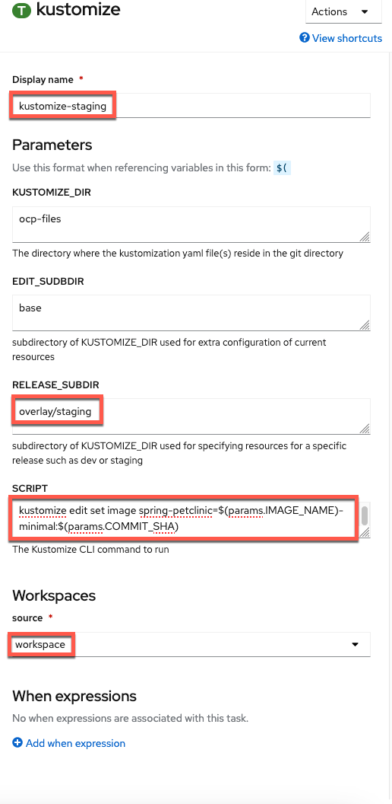
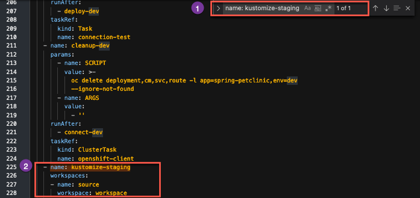

# From dev to staging

## Deploy Staging 

1. We will use our existing `kustomize-deploy-resources` task to deploy the `staging` version of our 
OpenShift files in a new task.

     
    
2. The only changes to make are

    Display Name:
    ``` bash
    kustomize-deploy-resources-staging
    ```

    and

    RELEASE_SUBDIR
    ``` bash
    overlay/staging
    ```

    to make the following configuration:

    

2. Add workspace to `kustomize-deploy-resources` task 

    Save current pipeline edit and switch to `yaml` from pipeline menu.

    

    !!! Info "Why are we editing yaml directly?"
        `Workspaces` are more versatile than traditional `PipelineResources` which is why we are using them. However, as the transition to workspaces continues, the OpenShift Pipeline Builder doesn't support editing the `Workspace` mapping from a pipeline to a task via the Builder UI so we have to do it directly in the yaml for now.

    Find the `kustomize-deploy-resources` and add the following workspace definition:

    ```
          workspaces:
          - name: source
            workspace: workspace
    ```

    

    Save the update

    

    !!! note
        After the save message above appears you can then proceed to `Cancel` back to the pipeline menu.

## Rollout Staging

1. Edit the pipeline again and add a `deploy-staging` task with the openshift-client `ClusterTask`

    

2. Give the task the following parameters to mirror that of the dev-deploy task which waits for the dev release to rollout to complete:

    

3. Save task