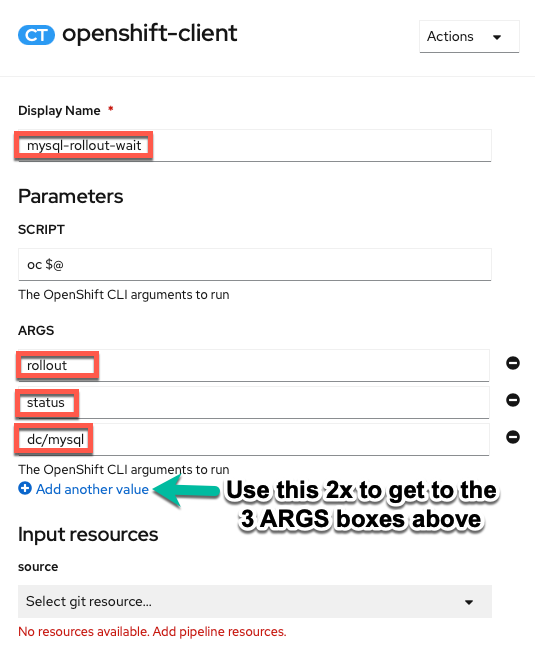
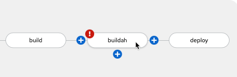
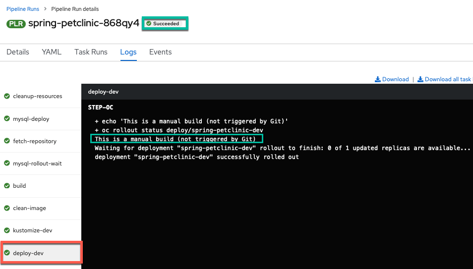

# PetClinic + OpenShift Pipelines = CI

Now that PetClinic is up and running on our OpenShift cluster, it's time to add functionality to our pipeline to achieve basic continuous integration. The OpenShift pipeline we created in the [PetClinic Up and Running](upandrunning.md) uses [Tekton](https://tekton.dev){target="_blank" rel="noopener noreferrer"} to run a series of tasks (each with one or more steps) to accomplish a workflow (pipeline). We will use the Pipeline Builder UI built into OpenShift to quickly and easily craft a pipeline for our project.

!!! info "Why OpenShift Pipelines?"
    - Portable: OpenShift resources defined via yaml files -> portable across OpenShift clusters

    - Low Resource Usage: Containers spin up when triggered -> resources only used when needed

    - Configurable: Can tailor overall pipeline and individual tasks to needs of your enterprise/organization 
    
    - Ease of Use: Pipeline Builder UI and built-in cluster resources (i.e. `ClusterTasks`, ClusterTriggerBindings`, etc.) enable you to easily create a pipeline and export the yaml files with minimal knowledge

## PetClinic Pipeline

When we deployed the PetClinic application using the `From Git` option in the [PetClinic Up and Running](upandrunning.md) section, we chose to create a basic pipeline. We'll start with this pipeline and edit it to add new functionality for our use case. 

Navigate to the `Pipelines` tab in the `Developer` perspective on the left and then click the three dots to the right of the pipeline name (`spring-petclinic`) and choose `Edit Pipeline`.  

## Ensure MySQL Database Deployed for each Run

This will bring us to the Pipeline Builder UI where we can edit our pipeline. Here we will make sure the MySQL database is configured according to our specification before the `build` task.

1. Add a `mysql-deploy` task in parallel to the `git-fetch` task. 
     

    !!! info "Why MySQL Parallel?"
        This ensures MySQL is in place for each `PetClinic` application build (which would fail without it).  

    Click on the middle of the bubble of the new task and choose the `openshift-client` task from the dropdown menu. 

    

    Enter the following command into the script field to ensure the MySQL database is available with the necessary configuration:

    ``` bash
    oc process openshift//mysql-ephemeral -p MYSQL_USER=petclinic -p MYSQL_PASSWORD=petclinic -p MYSQL_ROOT_PASSWORD=petclinic -p MYSQL_DATABASE=petclinic | oc apply -f -
    ```

    !!! note "Simply Click Away"
        Once you have entered the string into the `SCRIPT` section, just click away (i.e. on a regular section of the page) to get the configuration menu to go away and keep the new value(s) you just entered for the task.

    !!! Tip "What is `oc process` doing?"
        `oc process` is processing the [OpenShift template](https://docs.openshift.com/container-platform/4.7/openshift_images/using-templates.html#templates-overview_using-templates){target="_blank" rel="noopener noreferrer"} for the `mysql-ephemeral` database with the parameters given via a series of `-p` arguments and finally `oc apply -f -` ensures that any missing components will be recreated.

    

    !!! warning "No help please!"
        Make sure `help` is deleted from the `ARGS` section (it will be greyed out once deleted) or bad things will happen (i.e. the help screen will come up instead of the proper command running). 

2. Add a `mysql-rollout-wait` task

    We need to make sure that `mysql` is not only on its way to deploying but actually deployed before our `build` task begins. In order to achieve this, we will use the OpenShift Client again and wait for the `rollout` of the `mysql` `deploymentConfig` to complete after the `mysql-deploy` task. Add a sequential task after `mysql-deploy`:

    

    Fill out the task with the following parameters:

    

    !!! warning "No help please!"
        Make sure `help` is deleted from the `ARGS` section (it will be greyed out once deleted) or bad things will happen (i.e. the help screen will come up instead of the proper command running).

    !!! Tip "What the ARGS?"
        You may be wondering why we used the `SCRIPT` section in the `mysql-deploy` task for the entire command, but now are using the `ARGS` to individually list each argument of the command? Both work and so we are going through both methods here. On the one hand, the `SCRIPT` method is easier to copy and paste and looks the same as it would entered on the command line. On the other hand, the `ARGS` method adds readability to the task. Choose whichever method you prefer, though beware of input errors  with the `ARGS` method for long commands. _FYI: The equivalent `SCRIPT` command for the `mysql-rollout-wait` task is_:

        ``` bash
        oc rollout status dc/mysql
        ```
:tada: Now our build step will have `MySQL`  alive and well for it to use during the `build` step as required!

## Make Clean Image from S2I build

The `s2i-java-11` image is very convenient for making an image from source code. However, the simplicity that gives it value, can make it fail at meeting the needs of many organizations by itself. In our case, we will take the artifacts from the s2i image and copy them to a new Docker image that can meet all our needs to get the best of both worlds. We'll create an optimized image starting from a compact `openj9` java 11 base and employing [the advanced layers feature in spring](https://spring.io/blog/2020/01/27/creating-docker-images-with-spring-boot-2-3-0-m1#layered-jars){target="_blank" rel="noopener noreferrer"} that optimizes Docker image caching with the [final-Dockerfile](https://raw.githubusercontent.com/ibm-wsc/spring-petclinic/main/final-Dockerfile){target="_blank" rel="noopener noreferrer"} in the [ibm-wsc/spring-petclinic](https://github.com/ibm-wsc/spring-petclinic){target="_blank" rel="noopener noreferrer"} git repository we forked. 

1. Add `Buildah` task

    Add the `buildah` task as a sequential task after the `build` task.

    

2. Configure `buildah` task

    !!! Tip
        Each value that we need to configure is listed below with the value in a click-to-copy window (other values can be left alone to match image)

    

    DISPLAY NAME:
    ```
    producing-clean-image
    ```

    IMAGE:
    ```
    $(params.FINAL_IMAGE):$(params.COMMIT_SHA)
    ```

    DOCKERFILE:
    ```
    ./final-Dockerfile
    ```

    TLSVERIFY:
    ```
    false
    ```

    BUILD_EXTRA_ARGS:
    ```
    --build-arg PETCLINIC_S2I_IMAGE=$(params.IMAGE_NAME)
    ```

3. Add `FINAL_IMAGE`, `GIT_MESSAGE`, and `COMMIT_SHA` parameters to the pipeline

    

    **FINAL_IMAGE**

    `FINAL_IMAGE` Parameter Name:
    ```
    FINAL_IMAGE
    ```
    `FINAL_IMAGE` Parameter Description:
    ```
    Image Repository for Final Image
    ```
    `FINAL_IMAGE` Parameter Default Value:
    ```
    image-registry.openshift-image-registry.svc:5000/1619589196769/spring-petclinic-git-minimal
    ```

    **GIT_MESSAGE**

    `GIT_MESSAGE` Parameter Name:
    ```
    GIT_MESSAGE
    ```
    `GIT_MESSAGE` Parameter Description:
    ```
    Git commit message if triggered by Git, otherwise it's a manual build
    ```
    `GIT_MESSAGE` Parameter Default Value
    ```
    This is a manual build (not triggered by Git)
    ```

    **COMMIT_SHA**

    `COMMIT_SHA` Parameter Name:
    ```
    COMMIT_SHA
    ```
    `COMMIT_SHA` Parameter Description:
    ```
    SHA of Git commit if triggered by Git, otherwise just update manual tag
    ```
    `COMMIT_SHA` Parameter Default Value:
    ```
    latest
    ```

    !!! Tip
        Save parameters when done with entry before moving onto step 4.

4. Add workspace to `producing-clean-image` task 

    Save current pipeline edit and switch to `yaml` from pipeline menu.

    

    !!! info "Why are we editing yaml directly?"
        `Workspaces` are more versatile than traditional `PipelineResources` which is why we are using them. However, as the transition to workspaces continues, the OpenShift Pipeline Builder doesn't support editing the `Workspace` mapping from a pipeline to a task via the Builder UI so we have to do it directly in the yaml for now.

    Find the `producing-clean-image-task` and add the following workspace definition:

    ```
          workspaces:
          - name: source
            workspace: workspace
    ```

    

    Save the update

    

    !!! note
        After the save message above appears you can then proceed to `Cancel` back to the pipeline menu.

## Manage resource across environments with Kustomize

[Kustomize](https://kustomize.io){target="_blank" rel="noopener noreferrer"} is a tool for customizing Kubernetes resource configuration.

!!! note "From the documentation overview"
    Kustomize traverses a Kubernetes manifest to add, remove or update configuration options without forking. It is available both as a standalone binary and as a native feature of kubectl.

As part of doing things the "cloud-native way", we will be using Kustomize to manage resource changes across our `dev` and `staging` environments as well as injecting information from our pipeline (such as newly created image information with git commits) into our Kubernetes (OpenShift) resources. 

See our Kustomize configuration in our GitHub code in the subdirectories of the [ocp-files directory](https://github.com/ibm-wsc/spring-petclinic/tree/main/ocp-files){target="_blank" rel="noopener noreferrer"}

See the [kubectl documentation](https://kubectl.docs.kubernetes.io/guides/introduction/kustomize/){target="_blank" rel="noopener noreferrer"} for more information about how to use Kustomize via kubectl / oc.

### Creating Custom Task for Kustomize

Since there is no `ClusterTask` defined for Kustomize, we will create a custom task for this purpose. It will change into the Kustomize directory, run a Kustomize command on the directory, and then apply the files from the directory using the built-in Kustomize functionality of the oc command line tool (via kubectl's Kustomize support)

1. Copy the `kustomize-deploy-resources` Task using the following definition (copy by clicking on the copy icon in the top right of the box below):
    ``` bash
    apiVersion: tekton.dev/v1beta1
    kind: Task
    metadata:
      name: kustomize-deploy-resources
    spec:
      description: >-
        This task runs commands against the cluster where the task run is being
        executed.

        Kustomize is a tool for Kubernetes native configuration management.  It
        introduces a template-free way to customize application configuration that
        simplifies the use of off-the-shelf applications.  Now, built into kubectl
        as apply -k and oc as oc apply -k.
      params:
      - default: /workspace/source/ocp-files
        description: The directory where the kustomization yaml file(s) reside
        name: KUSTOMIZE_DIR
        type: string
      - default: base
        description: subdirectory of KUSTOMIZE_DIR used for extra configuration of current resources
        name: EDIT_SUDBDIR
        type: string
      - default: overlay/dev
        description: subdirectory of KUSTOMIZE_DIR used for specifying resources for a specific release such as dev or staging
        name: RELEASE_SUBDIR
        type: string
      - default: kustomize edit set image $(params.APP_NAME)=$(params.FINAL_IMAGE):$(params.COMMIT_SHA)
        description: The Kustomize CLI arguments to run
        name: SCRIPT
        type: string
      steps:
      - image: 'docker.io/gmoney23/kustomize-s390x:v4.1.2'
        name: kustomize
        resources:
          limits:
            cpu: 200m
            memory: 200Mi
          requests:
            cpu: 200m
            memory: 200Mi
        script: cd $(params.KUSTOMIZE_DIR)/$(params.EDIT_SUDBDIR) && $(params.SCRIPT)
      - image: 'image-registry.openshift-image-registry.svc:5000/openshift/cli:latest'
        name: apply-oc-files
        resources:
          limits:
            cpu: 200m
            memory: 200Mi
          requests:
            cpu: 200m
            memory: 200Mi
        script: oc apply -k $(params.KUSTOMIZE_DIR)/$(params.RELEASE_SUBDIR)
      workspaces:
      - name: source
        description: The git source code
    ```

2. Create the `kustomize-deploy-resources` Task
    
    a. Click `Import YAML` to bring up the box where you can create Kubernetes resource definitions from yaml

    b. Paste the `kustomize-deploy-resources` Task into the box
    
    c. Scroll down and click create to create the `kustomize-deploy-resources` Task 

    

You should now see the created `kustomize-deploy-resources` Task and navigate back to the Pipelines section of OpenShift and go back to editing your pipeline.


### Add Kustomize Task to Pipeline

1. Find `kustomize-deploy-resources` and add it to your pipeline after `producing-clean-image` 

    

2. Configure `kustomize-deploy-resources` task

    Since environment is `dev` for initial deploy, we can use all of the default values and change the `Display Name` to `kustomize-deploy-resources-dev`.

    

3. Add workspace to `kustomize-deploy-resources` task 

    Save current pipeline edit and switch to `yaml` from pipeline menu.

    

    !!! Info "Why are we editing yaml directly?"
        `Workspaces` are more versatile than traditional `PipelineResources` which is why we are using them. However, as the transition to workspaces continues, the OpenShift Pipeline Builder doesn't support editing the `Workspace` mapping from a pipeline to a task via the Builder UI so we have to do it directly in the yaml for now.

    Find the `kustomize-deploy-resources` and add the following workspace definition:

    ```
          workspaces:
          - name: source
            workspace: workspace
    ```

    

    Save the update

    

    !!! note
        After the save message above appears you can then proceed to `Cancel` back to the pipeline menu.

## Clean Old PetClinic Instances at the Beginning of a Run

1. Add an task named `cleanup-resources` sequentially at the beginning of the pipeline before `fetch-repository` (using the `openshift-client` ClusterTask).

    

2. Configure the task with a `SCRIPT` value of:

    ``` bash
    oc delete deployment,svc,route -l app=$(params.APP_NAME) --ignore-not-found
    ```

    and an empty `ARGS` value.

    

    !!! warning "No help please!"
        Make sure `help` is deleted from the `ARGS` section (it will be greyed out once deleted) or bad things will happen (i.e. the help screen will come up instead of the proper command running). 

## Update Deploy Task to deploy-dev

1. Change the name of the task at the end of the pipeline to `deploy-dev` and change the last `ARG` from `deploy/$(params.APP_NAME)` to:

    ``` bash
    deploy/$(params.APP_NAME)-dev
    ```

2. `Save` your pipeline!

## Run the Updated Pipeline

1. Go to `Actions` -> `Start` in the right hand corner of the pipeline menu

    

2. Manually trigger a `PipelineRun` by accepting the default values and clicking on `Start`.

    !!! Note "Persistent Volume Claim Note"
        Please select a `PersistentVolumeClaim` if it is not already filled out for you to complete your pipeline. If it is already filled out for you then jump right to starting the pipeline.

    

3. Watch the results of your build. It should run successfully as in the pictures below.

    **PipelineRun Success View Perspective:**

    

    **PipelineRun Success Logs Perspective:**

    


:thumbsup: