# Getting Your PetClinic Up and Running

For this workshop we will be using the iconic Spring PetClinic application. The Spring PetClinic is a sample application designed to show how the Spring stack can be used to build simple, but powerful database-oriented applications. [The official version of PetClinic](https://github.com/spring-projects/spring-petclinic) demonstrates the use of Spring Boot with Spring MVC and Spring Data JPA. 

We will not be focusing on the ins and outs of the PetClinic application itself, but rather on leveraging OpenShift tooling to build a PetClinic cloud-native application and a DevOps pipeline for the application.

We will start by building our PetClinic application from the source code and connecting it to a MySQL database.

!!! info "Using LinuxONE Community Cloud"
    Because you are using the LinuxONE Community Cloud OpenShift trial, your project name will be different from the project name depicted in the diagrams below. You will be operating in your assigned project for the entirety of the lab.

!!! note "Lab Guide"
    - For the images in this lab:
    - the <span style="color:green">green</span> arrows or boxes denote something to look at or reference 
    - the <span style="color:red">red</span> arrows or boxes denote something to click on or type.

## Deploying MySQL database

**1.** First, we need to setup our mysql database. Luckily, this is very easy on OpenShift with the mysql template available from the main developer topology window. Follow the steps in the diagram below to bring up the available database options. (Note your project name will be different than the picture below)

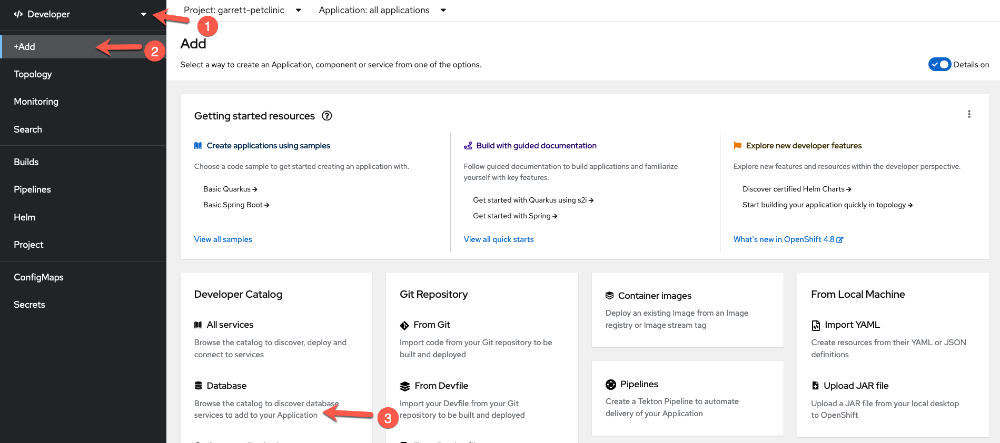

**2.** Next, select the `MySQL (Ephemeral)` tile. Note we are choosing the ephemeral option because at this point we do not care to persist the database beyond the life of the container.

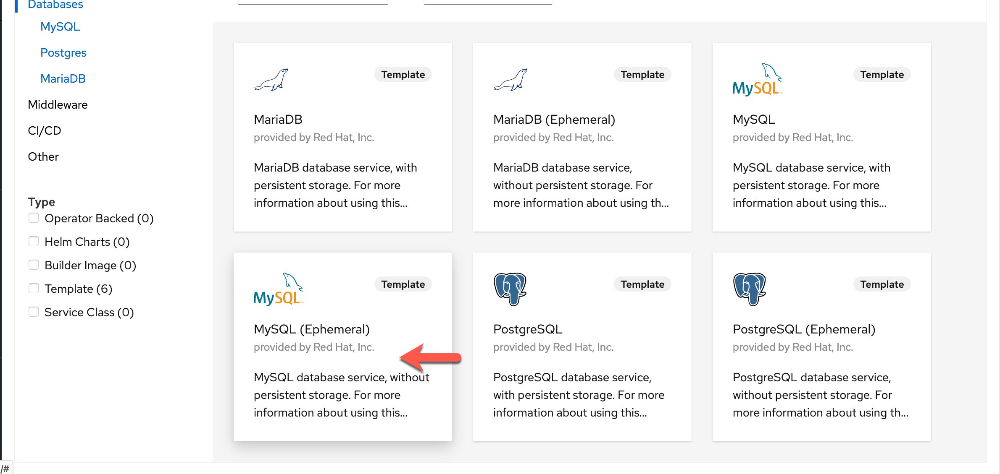

**3.** Click on instantiate template.

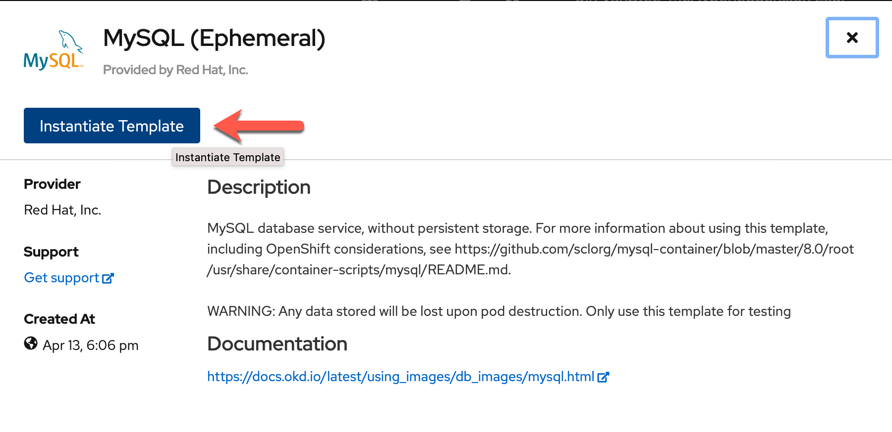

**4.** Fill the wizard with the parameters as shown in the image below (your namespace will be different from the image below):


Click the `Create` button. 

!!! info "Why Ephemeral?"
    We are using the **Ephemeral** implementation because this a short-lived demo and we do not need to retain the data.  In a staging or production environment, you will most likely be using a MySQL deployment backed by a Persistent Volume Claim. This stores the data in a Persistent Volume (basically a virtual hard drive), and the data will persist beyond the life of the container.

A minute or two later, in the `Topology` view of your OpenShift Console, you should see `mysql` in running state. (Click on the Topology icon for `mysql` to bring up the side panel)

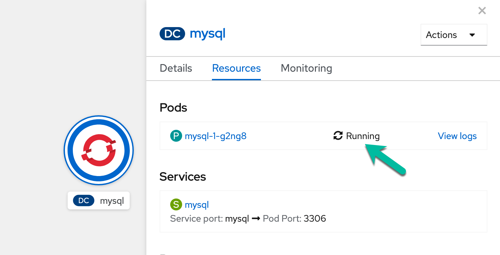

## Fork the PetClinic repo to your own GitHub account

For this workshop, you will be using the PetClinic application from your own GitHub account so that you can enable integrations with it later.

To make a copy of the PetClinic application into your GitHub account, navigate to the following from your browser:

```bash
https://github.com/ibm-wsc/spring-petclinic
```

Then click on the `fork` button on the upper right corner.


At this point you might need to log into GitHub if you weren't logged in already.

Next, you might be presented with a screen to ask you to select where to fork to. Select your own user account to fork to.

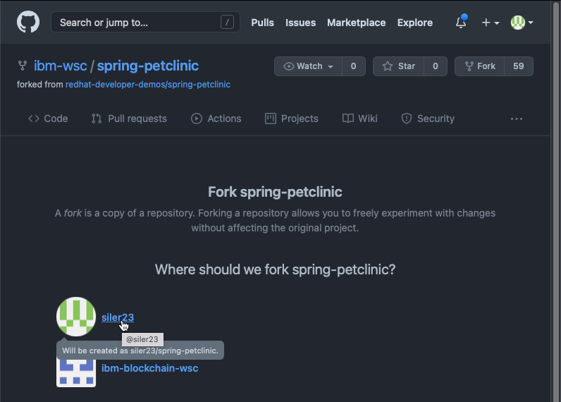

Please make a note of your repo URL for later. It should be something like:

```https://github.com/<your-github-username>/spring-petclinic```

That's it! You are ready to move on to the next section.

## Building and Deploying PetClinic Application

There are multiple ways OpenShift enables cloud-native application developers to package up their applications and deploy them. For PetClinic, we will be building our application image from source, leveraging OpenShift's S2I (Source to Image) capability. This allows us to quickly test the building, packaging, and deployment of our application, and gives us the option to create and use a DevOps pipeline from this workflow. It's a good way to start to understand how OpenShift Pipelines work.

**1.** Start with choosing Add From Git:

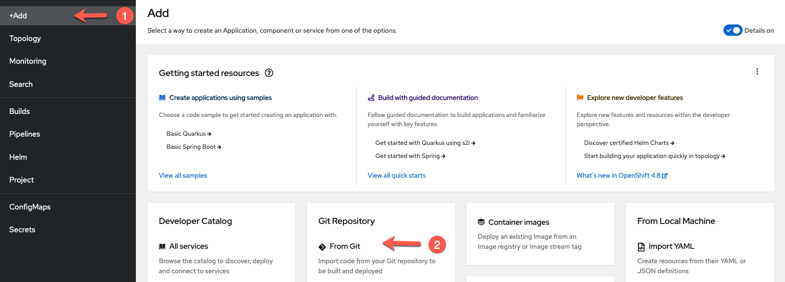

**2.** Enter `https://github.com/<your-github-ID>/spring-petclinic` in the `Git Repo URL` field. Expand the `Show Advanced Git Options` section, and type in `main` for the `Git Reference`. This tells OpenShift which GitHub repo and branch to pull the source code from.

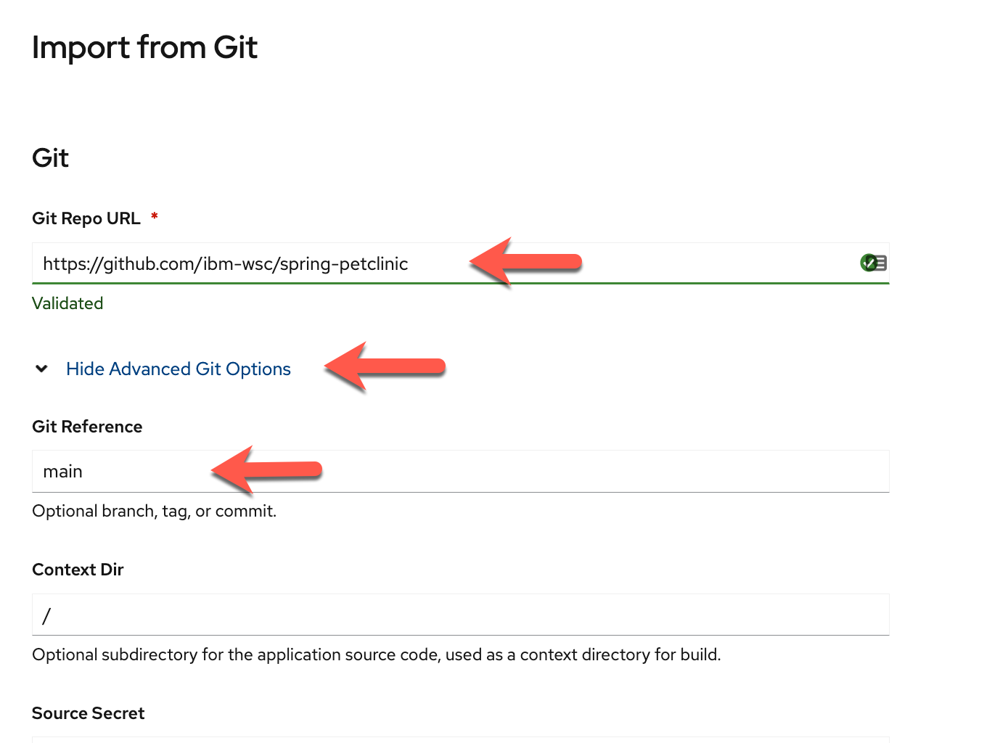

**3.** Scroll down to the Builder section. Select the `OpenJ9` tile and select `openj9-11-el8` as the builder image version. As you can see OpenShift offers many different builder images to help you build images from a variety of programming languages. Your list of builder images might differ from the screen shot. For Java on Z, the recommended JVM is `OpenJ9` because it has built-in s390x optimizations as well as container optimizations.

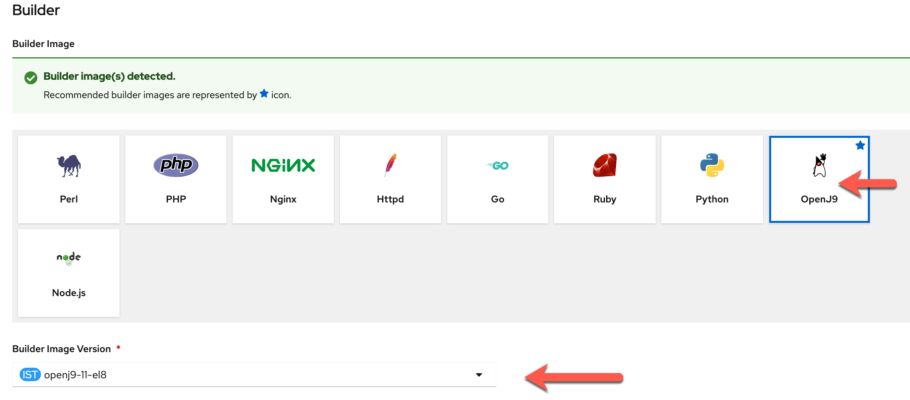

**4.** In the General section, put in the following entries for Application Name and Name. 


**5.** Scroll down to the  Pipelines section, and check off the box next to `Add pipeline`. You can also expand the `Show pipeline visualization` section to see a visual of the build pipeline.

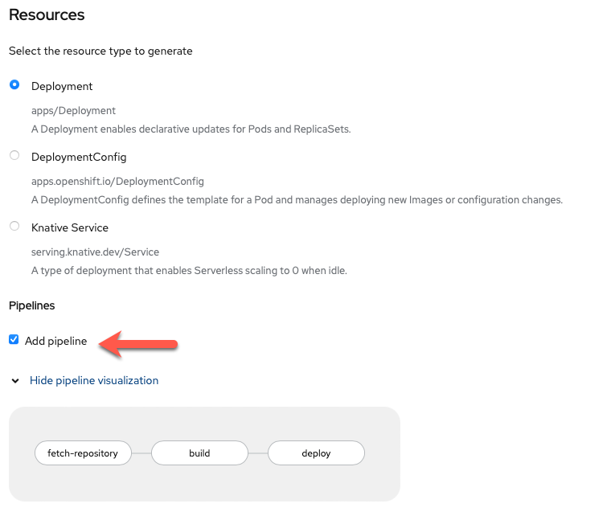

**6.** We are almost there! We will need to configure a couple of Advanced Options. First, click on `Routing` in the Advanced Options section to expand the Routing options.

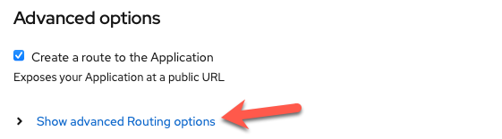

**7.** In the Routing options section, only fill out the Security options as follows. You can leave the rest alone. These options will enable only TLS access to your PetClinic application.


**8.** You are done with configurations of this panel. Scroll all the way down and hit the `Create` button which will kick off the pipeline build of your PetClinic application. In a few seconds you will see your Topology with the new application icon. Hit the little pipeline icon in the diagram below to view the build logs.

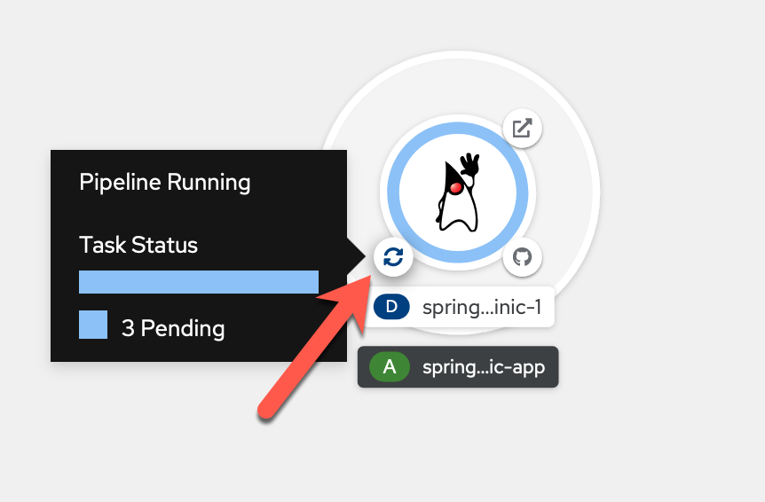

!!! warning "Log Streaming Gotcha in the LinuxONE CC"
    PLEASE BEWARE that if you are using the LinuxONE Community Cloud OpenShift Trial you might see lagginess with the log streaming. If it stops streaming you might want to go back out to the Topology view and once the pipeline completes, come back to the log view to see the logs.

**9.** The pipeline will go through three tasks:
    
&nbsp;&nbsp;&nbsp; 1. <b>fetch-repository</b> - this Pipeline task will clone your Git PetClinic repo for the build task.

&nbsp;&nbsp;&nbsp; 2. <b>build</b> - this Pipeline task is the build process which itself is broken down into a few sub-steps. This is the longest task in the pipeline, and can take up to 15 minutes. The steps that it goes through are as follows:

!!! info "build steps"
    - STEP-GEN-ENV-FILE: this step generates the environment file to be used during the build process
    - STEP-GENERATE: this step generates the Dockerfile that will be used to create the OCI image later on during the build step
    - STEP-BUILD: this is the multi-step build process of creating an OCI image out of your Java application PetClinic. It will download the required Maven Java packages, compile the Java application, run through a set of 39 unit tests on the application, and finally build the application jar file and the OCI image. If the tests fail, this step will not complete.
    - STEP-PUSH: this final step pushes the built OCI image to the OpenShift image registry.

&nbsp;&nbsp;&nbsp; 3. <b>deploy</b> - this Pipeline task will deploy the newly built image as a running deployment in your project. After this, your application will be running in a pod and be accessible via a route.

Below is an image of the log of a successful build task: 

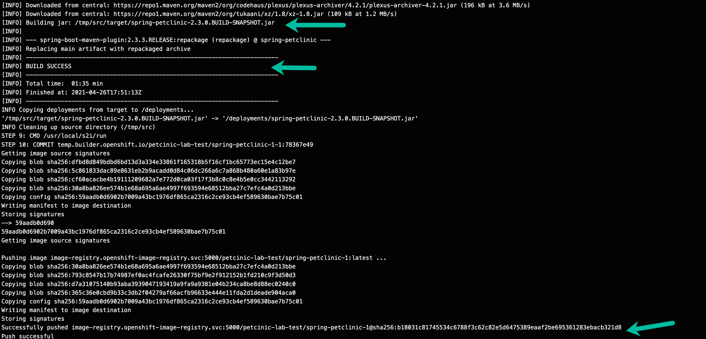

**10.** Now if you go back to the Topology view, you should see the application has been successfully deployed to OpenShift as well. From here you can click on the `open URL` circle, and a new browser tab should open to lead you to your PetClinic's front page.

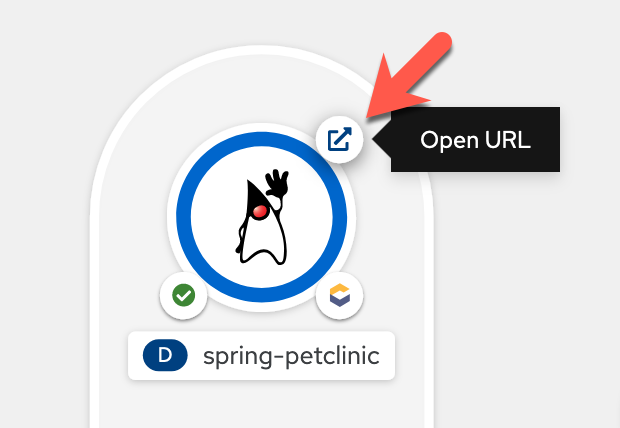

## Interacting with Your PetClinic Application and MySQL database

In this section, you will add a new owner to the Pet Clinic application, and then go into your MySQL container to see if that owner was successfully added. 

**1.** You Pet Clinic should look something similar to this. Go to the Find Owners tab, and create a new owner.

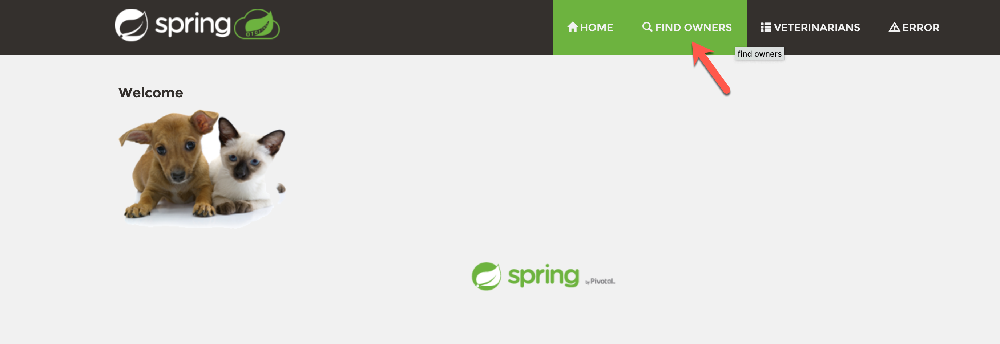

**2.** Click on the `Add Owner` button, and add an owner of your own, for example:

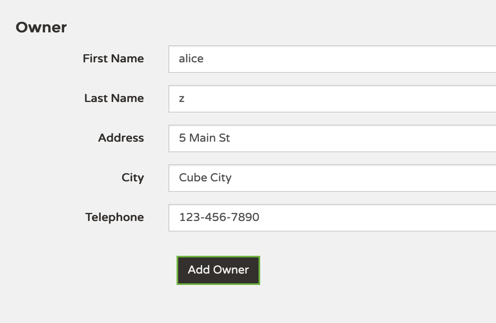

**3.** You can then go back to `Find Owners` and try searching for the owner that you just added. It should come back with the search results similar to the following.


**4.** Now let's check the MySQL database to make sure that the new owner you just added is in there.

Return to your OpenShift console, from the Topology view, click on the `mysql` icon. This will bring up a side panel, and then click on the `mysql` pod (your pod name will be different than the picture):

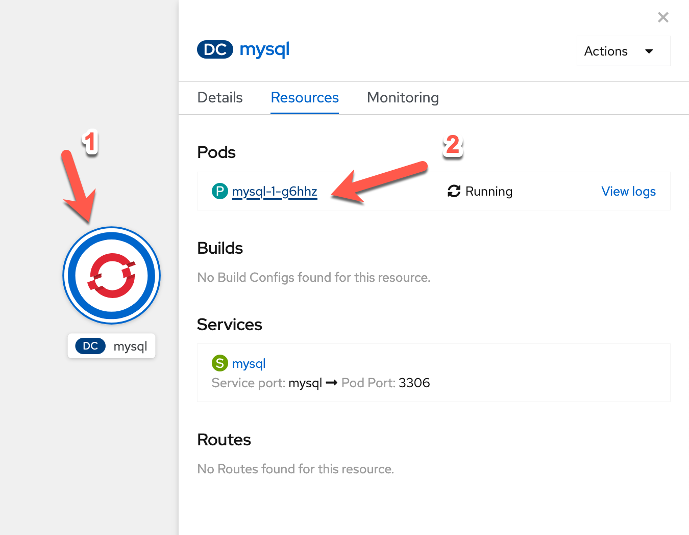

In the pod panel, go to the Terminal tab.


Now type in the following commands in your `mysql` terminal (copy and paste box below image):

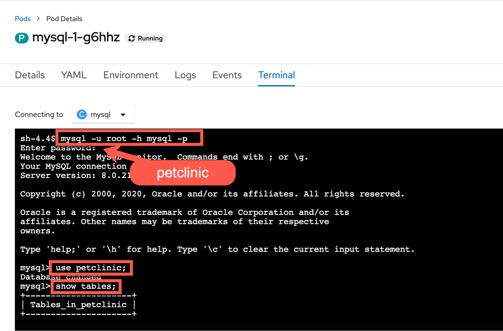

``` bash
mysql -u root -h mysql -p
```

``` mysql
use petclinic;
```

``` mysql
show tables;
```

Let's run a SQL command now to verify that the owner that we added through the application is indeed in the database (copy and paste box below image):

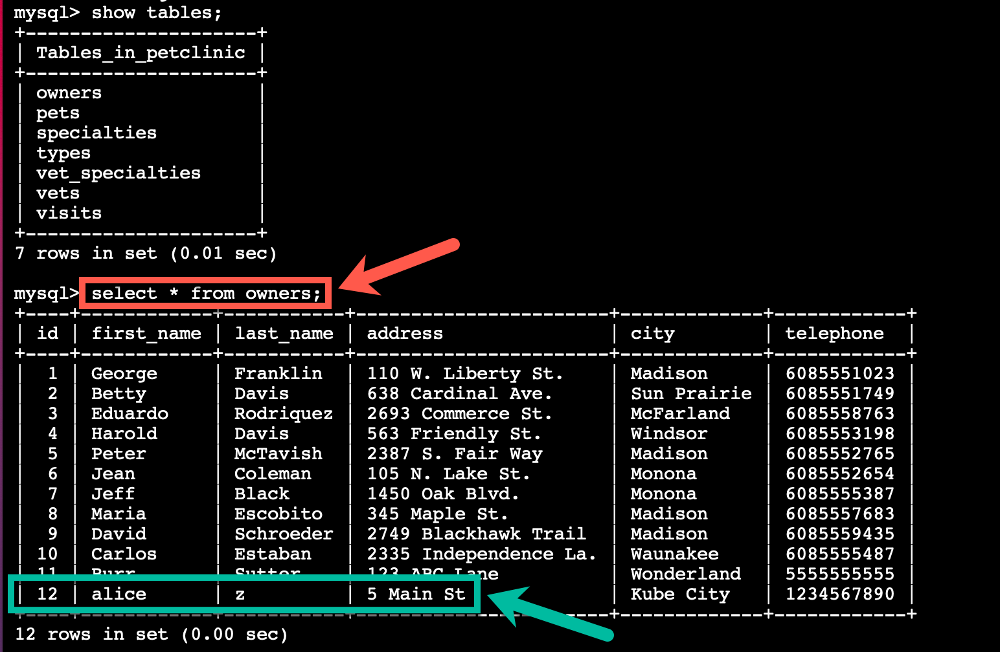

``` mysql
select * from owners;
```

Please let the instructors know, if you don't see your owner listed. 

Congratulations, you have completed this part of the workshop! You may move on to the next part, [PetClinic + OpenShift Pipelines = CI](pipeline.md).