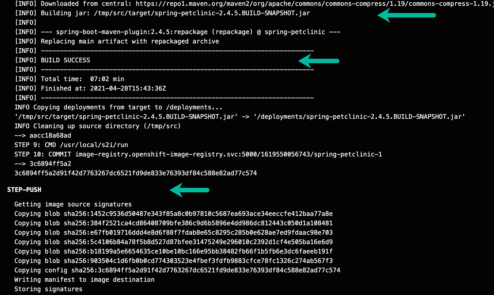

# Getting your PetClinic Open with a Shift (Title Placeholder for something less cheesy)

For this workshop we will be using the iconic Spring PetClinic application. The Spring PetClinic is a sample application designed to show how the Spring stack can be used to build simple, but powerful database-oriented applications. [The official version of PetClinic](https://github.com/spring-projects/spring-petclinic) demonstrates the use of Spring Boot with Spring MVC and Spring Data JPA. 

For this workshop, we will not be focusing on the ins and outs of the PetClinic application itself, but rather on leveraging OpenShift tooling to build a PetClinic cloud-native application and a DevOps pipeline for the application.

We will start by building our PetClinic application from the source code and connecting it to a MySQL database.

## Deploying MySQL database

**1.** First, we need to setup our mysql database. Luckily, this is very easy on OpenShift with the mysql template available from the main developer topology window. Follow the steps in the diagram below to bring up the available database options.


**2.** Next, select the `MySQL (Ephemeral)` tile. Note we are choosing the ephemeral option because at this point we do not care to persist the database beyond the life of the container.


**3.** Click on instantiate template.


**4.** Fill the wizard with the parameters as shown in the image below:


Click the `Create` button. 

Again, we are using the **Ephemeral** implementation because this a short-lived demo and we do not need to retain the data.  

In a production system, you will most likely be using a permanent MySQL instance. This stores the data in a Persistent Volume (basically a virtual hard drive), meaning the MySQL pod can be destroyed and replaced with the data remaining intact.

A minute or two later, in the `Topology` view of your OpenShift Console, you should see `mysql` in running state.


## Fork the PetClinic repo to your own GitHub account
### Place holder 

## Building and Deploying PetClinic Application

There are multiple ways OpenShift enables cloud-native application developers to package up their applications and deploy them. For PetClinic, we will be building our application image from source, leveraging OpenShift's S2I (Source to Image) capability. This allows us to quickly test the building, packaging, and deployment of our application, and gives us the option to create a DevOps pipeline from this workflow. It's a good way to start to  understand how OpenShift Pipelines work.

**1.** Start with choosing Add From Git:


**2.** Enter `https://github.com/ibm-wsc/spring-petclinic` in the `Git Repo URL` field. Expand the `Show Advanced Git Options` section, and type in `main` for the `Git Reference`. This tells OpenShift which GitHub repo and branch to pull the source code from.


**3.** Scroll down to the Builder section. Select the `OpenJ9` tile and select `openj9-11-el8` as the builder image version. As you can see OpenShift offers many different builder images to help you build images from a variety of programming languages. Your list of builder images might differ from the screen shot. For Java on Z, the recommended JVM is `OpenJ9` because it has built-in s390x optimizations as well as container optimizations.


**4.** In the General section, put in the following entries for Application Name and Name. 


**5.** Scroll down to the  Pipelines section, and check off the box next to `Add pipeline`. You can also expand the `Show pipeline visualization` section to see a visual of the build pipeline.


**6.** We are almost there! We will need to configure a couple of Advanced Options. First, click on `Routing` in the Advanced Options section to expand the Routing options.


**7.** In the Routing options section, only fill out the Security options as follows. You can leave the rest alone. These options will enable only TLS access to your PetClinic application.


**8.** Finally, we need to pass a build environment variable to tell the build process to run the application unit tests before building the application image. By default, the `OpenJ9` builder image skips the tests during the build process, but we want to automatically run the tests as part of our build pipeline to ensure its validity. Scroll to the bottom and select the `Build Configuration` link to expand that section.


**9.** Now, enter the following environment variable as shown in the diagram: ```MAVEN_ARGS=-e -Dcom.redhat.xpaas.repo.redhatga```


**10.** Finally, you are done with setting up the build. Hit the `Create` button to start your build and deploy process.

**11.** You will now be taken back to the Topology view. After a few seconds you should see the icon for build look like the following diagram, and you should then at this point click on the circle.


**12.** You will now be taken into the Logs section of your build, where you should begin to see the logs streaming from the progress of your build. Towards the end, you should see log messages similar to the following diagram, letting you know that the tests have all passed (39 unit tests are run, with 1 skipped, 0 failed). Please note, the logs will be easier to view if you Expand them.


**13.** The build will take several minutes to run. In the end, after the unit tests have been successfully run, you should see success messages that indicate a successful build, and push to the image registry.



**14.** Now if you go back to the Topology view, you should see the application has been successfully deployed to OpenShift as well. From here you can click on the `open URL` circle, and a new browser tab should open to lead you to your PetClinic's front page.


## Interacting with Your PetClinic Application and MySQL database

In this section, you will add a new owner to the Pet Clinic application, and then go into your MySQL container to see if that owner was successfully added. 

**1.** You Pet Clinic should look something similar to this. Go to the Find Owners tab, and create a new owner.


**2.** Click on the `Add Owner` button, and add an owner of your own, for example:


**3.** Now let's check the MySQL database to make sure that the new owner you just added is in there.

Return to your OpenShift console, from the Topology view, click on the `mysql` icon. This will bring up a side panel, and then click on the `mysql` pod (your pod name will be different than the picture):


In the pod panel, go to the Terminal tab.


Now type in the following commands in your `mysql` terminal:


Let's run a SQL command now to verify that the owner that we added through the application is indeed in the database:


Please let the instructors know, if you don't see your owner listed.