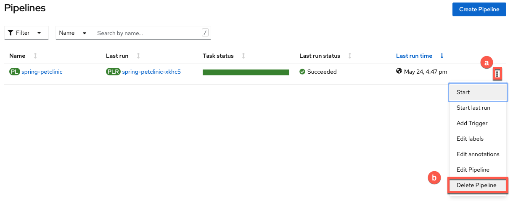
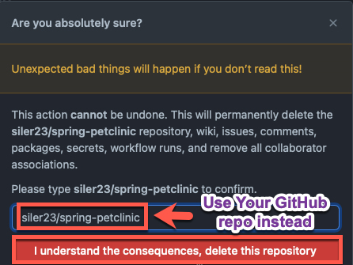

# Environment Cleanup

In this section you will clean up the different things you made during the lab in order to free up resources for other projects you intend to embark on in the community cloud as well as for other users of the environment.

## Pipelines Section Cleanup

From the `Pipelines` section of the OpenShift UI, please complete the following cleanup tasks:

1. Delete the trigger for your pipeline

    1. Choose to remove the trigger

        

        1. Click the 3 dots
        2. Choose `Remove Trigger`

    2. Confirm the trigger removal

        

        1. Choose your trigger from the dropdown menu
        2. Click `Remove`

2. Delete the pipeline

    

    1. Click the 3 dots
    2. Choose `Delete Pipeline`

## Topology Section Cleanup

From the `Topology` section of the OpenShift UI, please complete the following cleanup tasks:

1. Delete the `spring-petclinic-staging` deployment and its associated resources

    1. Right-click on the icon and choose `Delete Deployment`

        

    2. Click `Delete` (keep box checked to also delete dependent objects of this resource)

        

2. Delete `mysql` deployment config and its associated resources

    1. Right-click on the icon and choose `Delete DeploymentConfig`

        

    2. Click `Delete` (keep box checked to also delete dependent objects of this resource)

        

## GitHub Section Cleanup

Finally, you will cleanup the GitHub fork you made on your GitHub account with the following steps:

1. Navigate to the settings for your forked GitHub repository

    

2. Scroll to the bottom of the settings page (to the `danger zone`) and choose to delete your repository

    

3. Confirm repository delete (retyping your forked repository's name)

    
    
## :tada: Thank You for Cleaning Up! :tada:

--8<-- "includes/glossary.md"