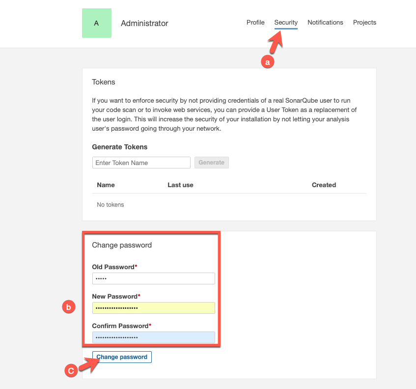
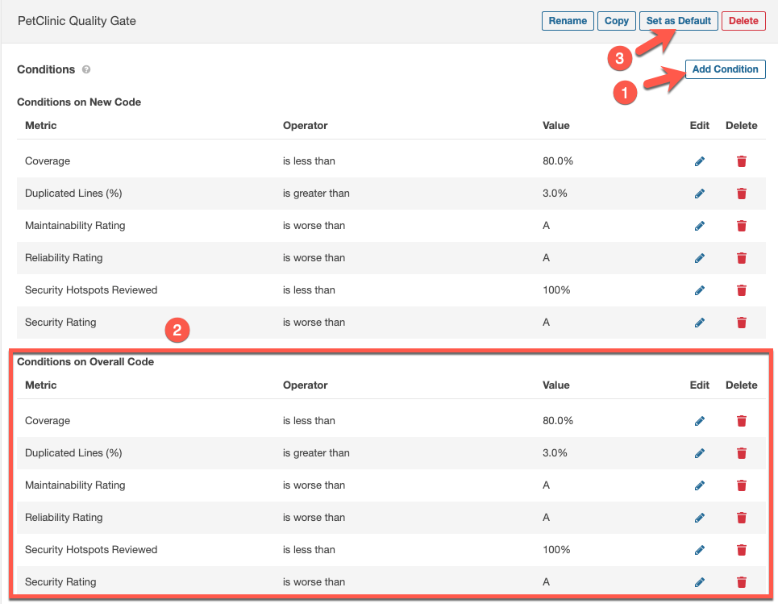

# Setting up SonarQube server in OpenShift

## Sign up for necessary accounts

1. Get a 2nd OpenShift cluster trial (in addition to the one you got for the regular lab, using a different email) [here](https://linuxone.cloud.marist.edu/#/register?flag=OCP){target="_blank" rel="noopener"}.

    !!! note
        Within 48 hours after you register, be sure to "Activate your account or entitlement" following the instructions in the follow-on email sent to the email address you specified during registration.

2. Setup access to the Container Images for IBM Z and LinuxONE using [this link](https://ibm.github.io/ibm-z-oss-hub/main/main.html){target="_blank" rel="noopener"} and scrolling down to the *Getting Started* section and then following it.

## Access OpenShift Cluster

!!! Note
    This should be a different OpenShift cluster than the one used for the main lab sections due to resource constraints.

1. Code for the project

    Please fork the code to your GitHub repository by [clicking here](https://github.com/ibm-wsc/spring-petclinic/fork){target="_blank" rel="noopener"}. If this fails, you likely already have a forked version of the repository from the lab. If so, go to your fork and use that in the next step.

2. Clone the git repository to your local computer 

    a. Get the link from GitHub using the `Code` button on your forked repository and the `HTTPS` tab. 

    b. Perform the clone locally in a terminal window using git clone + the link you copied such as `git clone https://github.com/siler23/spring-petclinic.git` for the example in `a.` above.

3. Log into OpenShift in a terminal window locally.

    a. Click on your username in the upper right hand of the LinuxONE Community Cloud OpenShift UI.

    b. Click `Copy Login command`

    

    c. In the new window that opens click `Display Token` to generate a login token.

    !!! note
        You may be prompted to enter your LinuxONE Community Cloud username and password again.
        
    

    d. Copy the login command.

    

    e. Use the login command in your terminal to login to your OpenShift project.

    

    !!! note
        Login token has been blurred in image for security purposes.

## Create OpenShift resources for SonarQube server

1. Create a Kubernetes (OpenShift) secret for the IBM Z Container Registry using your API Key

    ``` bash
    oc create secret docker-registry z-container-registry --docker-username=iamapikey --docker-server='icr.io' --docker-password='YOUR_API_KEY'
    ```

    !!! Note
        Please replace `YOUR_API_KEY` with your API Key for the IBM Z container registry.

2. Create OpenShift resources from PetClinic git repo you cloned.

    a. Change into the directory where you cloned your petclinic repo in step 2b of [Access OpenShift Cluster](#access-openshift-cluster).

    b. Apply the SonarQube server files to your project from the main directory of the cloned GitHub fork using the following command:

    ``` bash
    oc apply -f ocp-files/sonarqube-server
    ```

    !!! Example
        ```
        deployment.apps/sonarqube created
        service/sonarqube created
        route.route.openshift.io/sonarqube created
        persistentvolumeclaim/sonarqube-data created
        ```

## Access SonarQube server

1. Wait for the SonarQube server to come up and then access it at its route you can find the route via the oc command line tool in your logged in namespace using:

    ``` bash
    hostname="$(oc get route sonarqube -o jsonpath='{.spec.host}')" && echo "https://${hostname}"
    ```

    !!! note
        You can also use the user interface (UI) of your project.

2. Log into SonarQube server with default username/password of `admin`/`admin`

## Change Admin password

1. Access your account settings

    

    1. Click the `A` icon in the upper right hand corner

    2. Choose `My Account` from the droopdown menu

2. Change admin password 

    

    1. Choose the `Security` tab at the top of the page

    2. Enter your old password of `admin` and choose + confirm a new password 

    3. Click `Change Password`

## Create PetClinic Default SonarQube Quality Gate

1. Go to the `Quality Gates` tab.

    

2. Copy BUILT-IN Sonar way quality gate

    1. Choose to copy the gate 
        

    2. Choose a name for your new gate
        

3. Add conditions for `Overall Code`

    

    1. Click `Add Condition` for each Condition in the image above (the same ones used for `New Code`).

    2. Create each condition for `Overall Code` to match the image above.

    3. Click `Set as Default` to set the `PetClinic Quality Gate` as the default quality gate so that it will be used for the new projects created by users in the [SonarQube section](devsecops.md) of the lab.

## Summary
You have set up a SonarQube and are now ready to enjoy the [SonarQube section](devsecops.md) of the lab using your own SonarQube server. Congratulations!!!

!!! note
    Use the URL you used to access the SonarQube server as your SonarQube url in the [SonarQube section](devsecops.md).