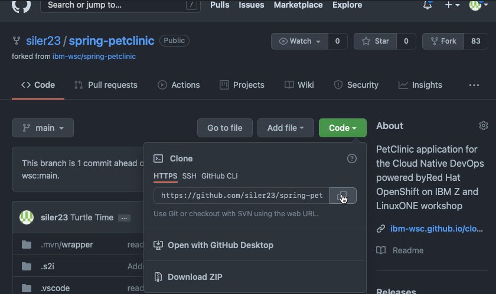
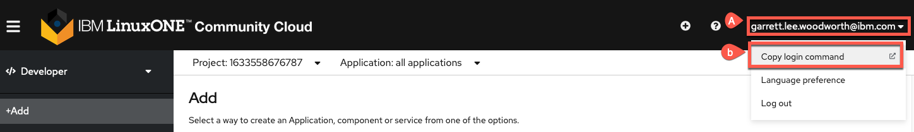
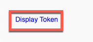
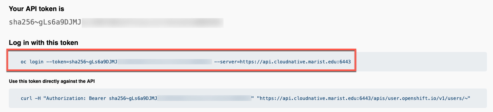
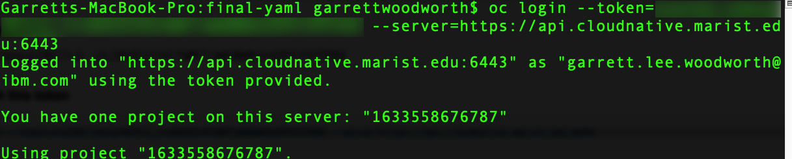
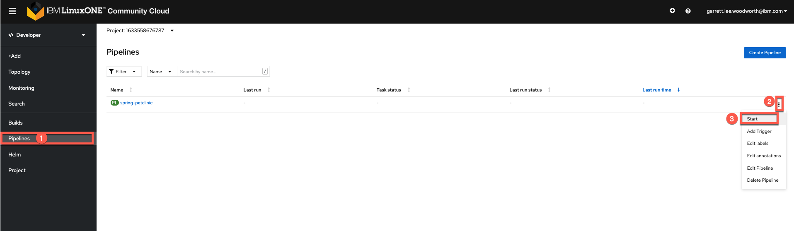
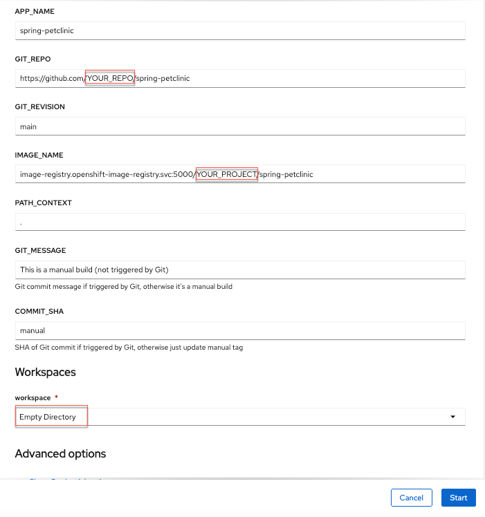
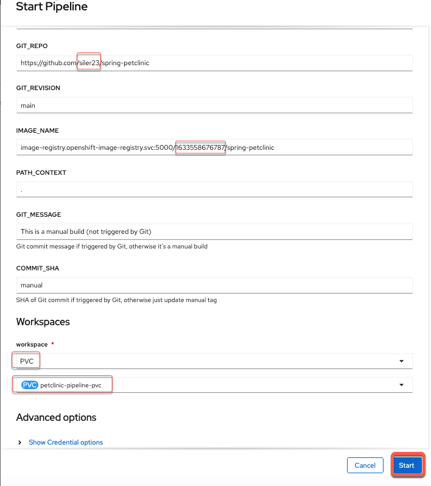

# Quick Start PetClinic pipeline with Yaml files

This section is for users that want to quickly bring up the pipeline and resources of the lab from yaml. This is good for users that have gone through the lab and want to learn how to quickly bring up the resources in a different cluster. This is what users will eventually want to do with pipelines they create (use yaml files to portably bring pipelines to different OpenShift clusters).

!!! Warning
    If you already have resources created from the lab, please do the [cleanup section here](cleanup/full-cleanup.md).

## Pre-requisites

1. Code for the project

    Please fork the code to your GitHub repository by [clicking here](https://github.com/ibm-wsc/spring-petclinic/fork){target="_blank" rel="noopener"}. If this fails, you likely already have a forked version of the repository from the lab. Please make sure you have done the [cleanup section here](cleanup/full-cleanup.md) and then come back to this section.

2. Clone the git repository to your local computer 

    a. Get the link from GitHub using the `Code` button on your forked repository and the `HTTPS` tab. 

    b. Perform the clone locally in a terminal window using git clone + the link you copied such as `git clone https://github.com/siler23/spring-petclinic.git` for the example in `a.` above.

3. Log into OpenShift in a terminal window locally.

    a. Click on your username in the upper right hand of the LinuxONE Community Cloud OpenShift UI.

    b. Click `Copy Login command`

    

    c. In the new window that opens click `Display Token` to generate a login token.

    !!! note
        You may be prompted to enter your LinuxONE Community Cloud username and password again.
        
    

    d. Copy the login command.

    

    e. Use the login command in your terminal to login to your OpenShift project.

    

    !!! note
        Login token has been blurred in image for security purposes.

4. Create OpenShift resources from PetClinic git repo you cloned.

    a. Change into the directory where you cloned your petclinic repo in step 2.

    b. Create the necessary project files in OpenShift from the main directory of the cloned GitHub fork using the following command:

    ```
    oc apply -f ocp-files/pipelines/final-yaml
    ```

    !!! Example
        ```
        task.tekton.dev/connection-test created
        pipeline.tekton.dev/spring-petclinic created
        task.tekton.dev/kustomize created
        persistentvolumeclaim/petclinic-pipeline-pvc created
        ```

5. Go to your newly created spring-petclinic pipeline via the `Pipelines UI` and start a new pipeline.

    

6. Replace the YOUR_REPO with your git base repository (Git Hub username) and YOUR_PROJECT with the your OpenShift Project (the one you have in community cloud or otherwise) and choose to back the workspace with a PVC (namely the petlcinic-pipeline-pvc) you created in step 4. 

    a. Initial Parameters

    

    b. Change Parameters and start pipeline

    !!! Note
        Your project and repo should be different from mine.

    

7. Your pipeline is back in action! :tada: