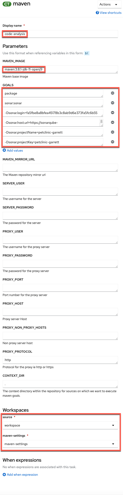
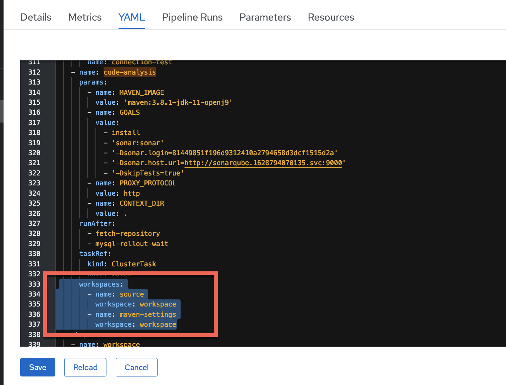
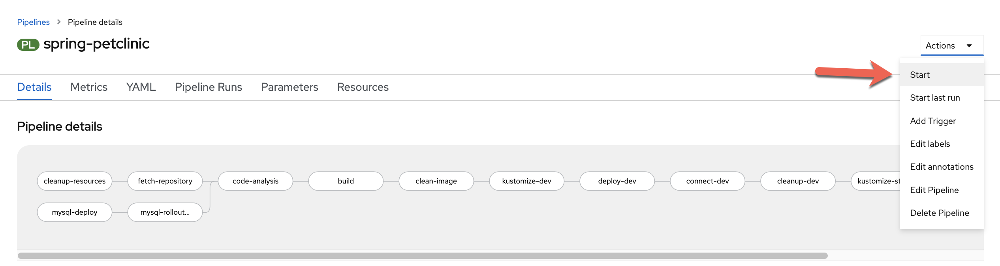

# Configure SonarQube code analysis in your Pipeline

As a bonus lab, you will now configure an extra task in your existing Pipeline to conduct code scanning on your petclinic source code. This exercise is to show you one way of incorporating security code scanning as part of your automated CI/CD pipeline.

We will use the popular open source package SonarQube to do the code scanning. According to Wikipedia, "SonarQube is an open-source platform developed by SonarSource for continuous inspection of code quality to perform automatic reviews with static analysis of code to detect bugs, code smells, and security vulnerabilities on 20+ programming languages."

For Petclinic, we will be using SonarScanner for Maven. The ability to execute the SonarQube analysis via a regular Maven goal makes it available anywhere Maven is available (developer build, CI server, etc.), without the need to manually download, setup, and maintain a SonarQube Runner installation. For more information on SonarScanner for Maven, please see [here](https://docs.sonarqube.org/latest/analysis/scan/sonarscanner-for-maven/).

## Accessing the SonarQube server with your assigned credentials

The lab instructors have already setup a SonarQube server within the OpenShift cluster for you to access for code scanning. Credentials have also been setup for you. Please use your assigned credentials to test access to the SonarQube Server.

Access the SonarQube server [here](https://sonarqube-1628794070135.apps.cloudnative.marist.edu/about)

Select `Log in` in the upper right hand corner. And log in with your assigned credentials.

If you are not successful with this step, please let the instructor know.

## Generate a security token for your SonarQube account

You'll need either your credentials, or an access token associated with your account, in order to access the server for code scanning. 

Let's use the access token method.

Now that you've logged in, select your account in the upper right hand corner of the SonarQube server page.

 

In the account panel, go to the security tab, and type in the name `petclinic` to help identify your token, and then select `Generate`. Now copy and save this token to be used in the next step.

 

## Configuring maven-settings with the Sonar scanner plugin

We need to configure maven with the Sonar scanner plugin prefix. We will do that by including the sonar scanner plugin in the maven settings file.

We will create a Kubernetes ConfigMap for the mavens settings file.

Click on the import button at the top of the OpenShift console.

Copy and paste the entirety of the following into the editor and then hit "Save" (copy by clicking on the copy icon in the top right of the box below).

```bash
apiVersion: v1
kind: ConfigMap
metadata:
  name: maven-settings
data:
  settings.xml: |
    <?xml version="1.0" encoding="UTF-8"?>
    <settings>
      <pluginGroups>
        <pluginGroup>org.sonarsource.scanner.maven</pluginGroup>
      </pluginGroups>
      <profiles>
        <profile>
            <id>sonar</id>
            <activation>
                <activeByDefault>true</activeByDefault>
            </activation>
        </profile>
      </profiles>
    </settings>
```

## Configuring maven task into Pipeline to do code analysis

Go back to your OpenShift console and go to your pipeline. Your pipeline should look like the picture below, at this point of the workshop.

 

We will insert the code analysis task before the build task. The idea being we want to scan the source code for bugs and vulnerabilities, before we build a container image out of it.

From your pipeline screen, Go to Actions -> Edit Pipeline.

Select the plus sign before the build task, as in the picture below.


Then select the task `maven` from the drop down list.


!!! tip
    Once you add a specific task (i.e. `maven`), clicking on the oval of the task will enable you to edit its default values for your needs.

Give the task the following parameters to do the code analysis with the proper maven goals set to do code scanning against our SonarQube server, <b>be careful to substitute the `-Dsonar.login` goal with the token that you generated in the previous step. Also be mindful to put your name in the value of the `Dsonar.projectName` goal.</b> 



**Display Name**

``` bash
code-analysis
```

**MAVEN_IMAGE**
``` bash
maven:3.8.1-jdk-11-openj9
```

**GOALS**

``` bash
install
```
``` bash
sonar:sonar
```
``` bash
-Dsonar.login=<use-your-token-from-previous-step>
```
``` bash
-Dsonar.host.url=http://sonarqube.1628794070135.svc:9000
``` 
``` bash
-Dsonar.projectName=petclinic-<your-name>
```
``` bash
-Dsonar.projectVersion=1
```
``` bash
-Dsonar.qualitygate.wait=true
```
``` bash
-DskipTests=true
```

Now you can click away to get back to the main pipeline edit panel. <b>Save the pipeline.</b>

Now we will need to add our pipeline workspaces to this task, and we'll do this by editing the pipeline yaml with the following in the `code-analysis` section:



Hit the Save button to save the pipeline.

## Run the pipeline

Go to the Actions menu of your pipeline and select Start.



Hit Start after reviewing the settings panel.

You can go to your pipeline logs and see the output for each of the tasks. <TO DO .. add screen shot of pipeline logs>

It will take 15-20 minutes for the code analysis to run completely through. This task will wait until the quality check is complete in SonarQube and if the quality gate fails, this task will fail and the pipeline will not continue to run. If the quality gate succeeds, this task will succeed and progress onto the next task in the pipeline.

Let's see if our code passes the code analysis.


<TO DO.. add screen shot of failure output>

At this point you can return to the SonarQube server here, and view the code scan report to see what caused the quality check to fail.

<TO DO.. add screen shot of SonarQube project page>

## Access the code analysis report (put this and follow-on steps in a separate section)

## Update code-analysis task with new project version

## Fix the code which will automatically trigger another pipeline run

## Review final results

