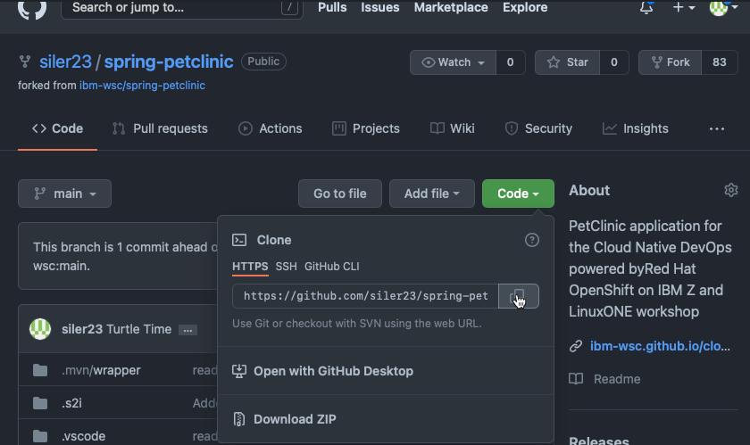
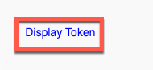

# Setting up SonarQube server in OpenShift

## Sign up for necessary accounts

1. Get a 2nd OpenShift cluster trial (in addition to the one you got for the regular lab, using a different email)

2. Sign up for IBM Z Container Registry trial

## Access OpenShift Cluster

!!! Note
    This should be a different OpenShift cluster than the one used for the main lab sections due to resource constraints.

1. Code for the project

    Please fork the code to your GitHub repository by [clicking here](https://github.com/ibm-wsc/spring-petclinic/fork){target="_blank" rel="noopener noreferrer"}. If this fails, you likely already have a forked version of the repository from the lab. If so, go to your fork and use that in the next step.

2. Clone the git repository to your local computer 

    a. Get the link from GitHub using the `Code` button on your forked repository and the `HTTPS` tab. 

    b. Perform the clone locally in a terminal window using git clone + the link you copied such as `git clone https://github.com/siler23/spring-petclinic.git` for the example in `a.` above.

3. Log into OpenShift in a terminal window locally.

    a. Click on your username in the upper right hand of the LinuxONE Community Cloud OpenShift UI.

    b. Click `Copy Login command`

    

    c. In the new window that opens click `Display Token` to generate a login token.

    !!! note
        You may be prompted to enter your LinuxONE Community Cloud username and password again.
        
    

    d. Copy the login command.

    

    e. Use the login command in your terminal to login to your OpenShift project.

    

    !!! note
        Login token has been blurred in image for security purposes.

## Create OpenShift resources for SonarQube server

1. Create a Kubernetes (OpenShift) secret for the IBM Z Container Registry using your API Key

    ``` bash
    oc create secret docker-registry z-container-registry --docker-username=iamapikey --docker-server='icr.io' --docker-password='YOUR_API_KEY'
    ```

    !!! Note
        Please replace `YOUR_API_KEY` with your API Key for the IBM Z container registry.

2. Create OpenShift resources from PetClinic git repo you cloned.

    a. Change into the directory where you cloned your petclinic repo in step 2b of [Access OpenShift Cluster](#access-openshift-cluster).

    b. Apply the SonarQube server files to your project from the main directory of the cloned GitHub fork using the following command:

    ``` bash
    oc apply -f ocp-files/sonarqube-server
    ```

    !!! Example
        ```
        deployment.apps/sonarqube created
        service/sonarqube created
        route.route.openshift.io/sonarqube created
        persistentvolumeclaim/sonarqube-data created
        ```

## Access and Setup SonarQube Server

1. Wait for the SonarQube server to come up and then access it at its route you can find the route via the oc command line tool in your logged in namespace using:

    ``` bash
    hostname="$(oc get route sonarqube -o jsonpath='{.spec.host}')" && echo "https://${hostname}"
    ```

    !!! note
        You can also use the user interface (UI) of your project.

2. Change the admin password for your SonarQube server

3. Add new quality gate for new code and overall code and make it the default quality gate for your SonarQube server