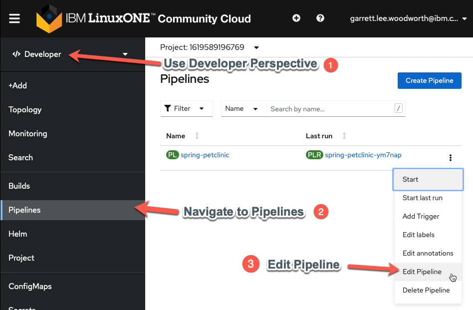
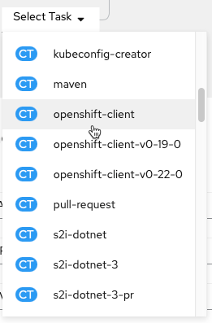
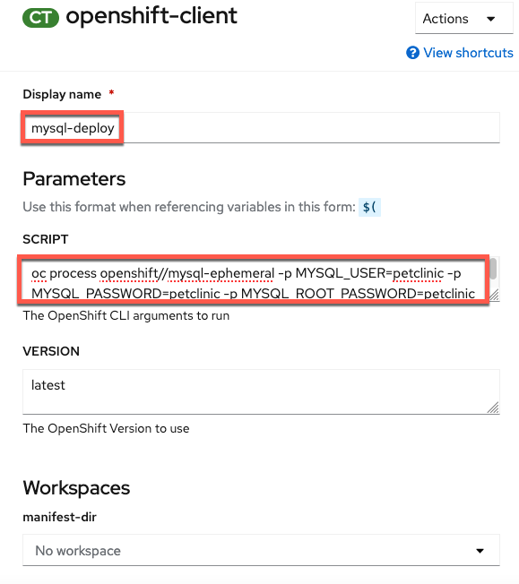
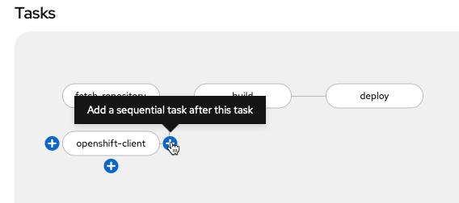
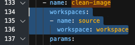
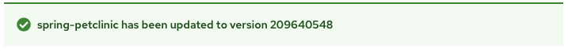

# Configure PetClinic Build and Test to Meet your Organization's Requirements[^1]

Now that PetClinic is up and running on your OpenShift cluster, it's time to add functionality to your pipeline to achieve basic integration and deployment when triggered. The OpenShift pipeline you created in the [PetClinic Up and Running](../build-and-deploy/upandrunning.md) uses [Tekton](https://tekton.dev){target="_blank" rel="noopener noreferrer"} to run a series of tasks (each with one or more steps) to accomplish a workflow (pipeline). You will use the Pipeline Builder UI built into OpenShift to quickly and easily craft a pipeline that meets your specific needs.

!!! info "Why OpenShift Pipelines?"
    - Portable: OpenShift resources defined via yaml files -> portable across OpenShift clusters

    - Low Resource Usage: Containers spin up when triggered -> resources only used when needed

    - Configurable: Can tailor overall pipeline and individual tasks to needs of your enterprise/organization 
    
    - Ease of Use: Pipeline Builder UI and built-in cluster resources (i.e. `ClusterTasks`, `ClusterTriggerBindings`, etc.) enable you to easily create a pipeline and export the yaml files with minimal knowledge

## PetClinic Pipeline

When you deployed the PetClinic application using the `From Git` option in the [PetClinic Up and Running](../build-and-deploy/upandrunning.md) section, you chose to create a basic pipeline. You'll start with this pipeline and edit it to add new functionality for your use case. 

Navigate to the `Pipelines` tab in the `Developer` perspective on the left and then click the three dots to the right of the pipeline name (`spring-petclinic`) and choose `Edit Pipeline`.  

## Ensure MySQL Database Deployed for each Run

This will bring you to the Pipeline Builder UI where you can edit your pipeline. Here you will make sure the MySQL database is configured according to your specification before the `build` task.

1. Add a `mysql-deploy` task in parallel to the `git-fetch` task. 
     

    !!! info "Why is `mysql-deploy` in Parallel?"
        This ensures MySQL is in place for each `PetClinic` application build (which would fail without it).  

    Click `Select Task` in the middle of the rectangle of the new task and choose the `openshift-client` task from the dropdown menu. 

    

    Click on the middle of the oval of the `openshift-client` task to enter values for it (copy and paste boxes below image).

    

    !!! Tip
        Once you add a specific task (i.e. `openshift-client`), clicking on the oval of the task will enable you to edit its default values for your needs.

    Give the task the following parameters to ensure the MySQL database is available with the necessary configuration:

    

    **Display Name**

    ``` bash
    mysql-deploy
    ```

    **SCRIPT**

    ``` bash
    oc process openshift//mysql-ephemeral -p MYSQL_USER=petclinic -p MYSQL_PASSWORD=petclinic -p MYSQL_ROOT_PASSWORD=petclinic -p MYSQL_DATABASE=petclinic | oc apply -f -
    ```

    !!! note "Simply Click Away"
        Once you have entered the string into the `SCRIPT` section, just click away (i.e. on a regular section of the page) to get the configuration menu to go away and keep the new value(s) you just entered for the task.

    !!! Tip "What is `oc process` doing?"
        `oc process` is processing the [OpenShift template](https://docs.openshift.com/container-platform/4.7/openshift_images/using-templates.html#templates-overview_using-templates){target="_blank" rel="noopener noreferrer"} for the `mysql-ephemeral` database with the parameters given via a series of `-p` arguments and finally `oc apply -f -` ensures that any missing components will be recreated.

    !!! warning "No help please!"
        Make sure `help` is deleted from the `ARGS` section (it will be greyed out once deleted) or bad things will happen (i.e. the help screen will come up instead of the proper command running). 

2. Add a `mysql-rollout-wait` task

    You need to make sure that `mysql` is fully deployed before your `build` task begins. In order to achieve this, you will use the OpenShift Client again and wait for the `rollout` of the `mysql` `deploymentConfig` to complete after the `mysql-deploy` task. Add a sequential task after `mysql-deploy`:

    

    `Select Task` as `openshift-client` like before and then fill out the task with the following parameters (copy and paste boxes below image for changes):

    

    **Display Name**

    ``` bash
    mysql-rollout-wait
    ```

    **ARGS**

    ``` bash
    rollout
    ```
    
    ``` bash
    status
    ```

    ``` bash
    dc/mysql
    ```

    !!! warning "No help please!"
        Make sure `help` is deleted from the `ARGS` section (it will be greyed out once deleted) or bad things will happen (i.e. the help screen will come up instead of the proper command running).

    !!! Tip "What the ARGS?"
        You may be wondering why you used the `SCRIPT` section in the `mysql-deploy` task for the entire command, but now are using the `ARGS` to individually list each argument of the command? Both work and so you are going through both methods here. On the one hand, the `SCRIPT` method is easier to copy and paste and looks the same as it would entered on the command line. On the other hand, the `ARGS` method adds readability to the task. Choose whichever method you prefer, though beware of input errors  with the `ARGS` method for long commands. _FYI: The equivalent `SCRIPT` command for the `mysql-rollout-wait` task is_:

        ``` bash
        oc rollout status dc/mysql
        ```

:tada: Now your `mysql-deploy` and `mysql-rollout` tasks will have `MySQL` alive and well for the `build` task!

## Make Clean Image from S2I build

The `s2i-java-11` image is very convenient for making an image from source code. However, the simplicity that gives it value can make it fail at meeting the needs of many organizations by itself. In your case, you will take the artifacts from the s2i image and copy them to a new Docker image that can meet all your needs to get the best of both worlds. You'll create an optimized image starting from a compact `openj9` java 11 base and employing [the advanced layers feature in spring](https://spring.io/blog/2020/01/27/creating-docker-images-with-spring-boot-2-3-0-m1#layered-jars){target="_blank" rel="noopener noreferrer"} that optimizes Docker image caching with the [final-Dockerfile](https://raw.githubusercontent.com/ibm-wsc/spring-petclinic/main/final-Dockerfile){target="_blank" rel="noopener noreferrer"} in the [ibm-wsc/spring-petclinic](https://github.com/ibm-wsc/spring-petclinic){target="_blank" rel="noopener noreferrer"} git repository you forked. 

1. Add `Buildah` task

    Add the `buildah` task as a sequential task after the `build` task.

    

2. Configure `buildah` task

    !!! Tip
        Each value that you need to configure is listed below with the value in a click-to-copy window (other values can be left alone to match the image)

    

    DISPLAY NAME:
    ```
    clean-image
    ```

    IMAGE:
    ```
    $(params.IMAGE_NAME)-minimal:$(params.COMMIT_SHA)
    ```

    DOCKERFILE:
    ```
    ./final-Dockerfile
    ```

    TLSVERIFY:
    ```
    false
    ```

    BUILD_EXTRA_ARGS:
    ```
    --build-arg PETCLINIC_S2I_IMAGE=$(params.IMAGE_NAME)
    ```

3. Add `GIT_MESSAGE`, and `COMMIT_SHA` parameters to the pipeline

    Click `Add Parameter` twice ...

    

    and then fill in the parameter details for `GIT_MESSAGE` and `COMMIT_SHA` (copy and paste boxes below image)

    

    **GIT_MESSAGE**

    `GIT_MESSAGE` Parameter Name:
    ```
    GIT_MESSAGE
    ```
    `GIT_MESSAGE` Parameter Description:
    ```
    Git commit message if triggered by Git, otherwise it's a manual build
    ```
    `GIT_MESSAGE` Parameter Default Value
    ```
    This is a manual build (not triggered by Git)
    ```

    **COMMIT_SHA**

    `COMMIT_SHA` Parameter Name:
    ```
    COMMIT_SHA
    ```
    `COMMIT_SHA` Parameter Description:
    ```
    SHA of Git commit if triggered by Git, otherwise just update manual tag
    ```
    `COMMIT_SHA` Parameter Default Value:
    ```
    manual
    ```

    !!! Tip
        Save parameters when done with entry by clicking on blue `SAVE` box before moving onto step 4. If blue `SAVE` box doesn't appear (is greyed out) delete extra blank parameters you may have accidentally added with the `-`.

4. Add workspace to `clean-image` task 

    1. Save current pipeline edit and switch to `YAML` from pipeline menu.

        

        !!! info "Why are you editing yaml directly?"
            `Workspaces` are more versatile than traditional `PipelineResources` which is why you are using them. However, as the transition to workspaces continues, the OpenShift Pipeline Builder doesn't support editing the `Workspace` mapping from a pipeline to a task via the Builder UI so you have to do it directly in the yaml for now.

    2. Find the `clean-image-task` and add the following workspace definition:

        ``` yaml
              workspaces:
              - name: source
                workspace: workspace
        ```

        

    3. Save the update

        

        !!! note
            After the save message above appears you can then proceed to `Cancel` back to the pipeline menu.

## Summary :waxing_crescent_moon:
Your pipeline will now automatically check that your `MySQL` instance is configured properly and rolled out before moving on to the build stage (instead of doing this as a manual task like in the previous section of the lab). Moreover, it will curate the final PetClinic (`minimal`) image to only have the necessary components instead of a bunch of extra packages (required only for the build itself) that add bloat and potential security vulnerabilities to your image. Finally, it will tag the image to distinguish between manual builds and those triggered by a potential git push. In the next section, you will see this automation in action for your development environment.

[^1]: For the purposes of this lab, you are fulfilling the requirements of a fictional organization. These requirements could change for your specific organization but would follow a similar pattern with different specifics.