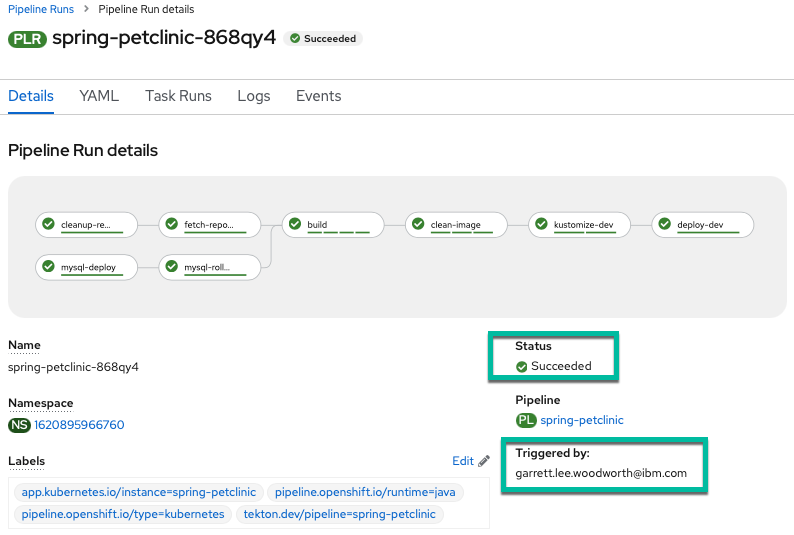

# Configure PetClinic Development Deployment to Meet your Organization's Requirements[^1]

## Manage resource across environments with Kustomize

[Kustomize](https://kustomize.io){target="_blank" rel="noopener noreferrer"} is a tool for customizing Kubernetes resource configuration.

!!! note "From the documentation overview"
    Kustomize traverses a Kubernetes manifest to add, remove or update configuration options without forking. It is available both as a standalone binary and as a native feature of kubectl. See the [Introducing Kustomize Kubernetes Blog Post](https://kubernetes.io/blog/2018/05/29/introducing-kustomize-template-free-configuration-customization-for-kubernetes/){target="_blank" rel="noopener noreferrer"} for a more in-depth overview of Kustomize and its purpose.

As part of doing things the "cloud native" way you will be using Kustomize to manage resource changes across your `dev` and `staging` environments as well as injecting information from your pipeline (such as newly created container image information with git commits) into your Kubernetes (OpenShift) resources. 

To see how you use Kustomize, see the Kustomize configuration in your GitHub code in the subdirectories of the [ocp-files directory](https://github.com/ibm-wsc/spring-petclinic/tree/main/ocp-files){target="_blank" rel="noopener noreferrer"}.

For more information on how kubectl (and oc through kubectl) integrates Kustomize, see the [kubectl documentation](https://kubectl.docs.kubernetes.io/guides/introduction/kustomize/){target="_blank" rel="noopener noreferrer"}.

### Creating Custom Task for Kustomize

Since there is no ClusterTask defined for Kustomize, you will create a custom task for this purpose. It will change into the Kustomize directory, run a Kustomize command on the directory, and then apply the files from the directory using the built-in Kustomize functionality of the oc command line tool (via kubectl's Kustomize support)

1. Copy the `kustomize` task using the following definition (copy by clicking on the copy icon in the top right of the box below):

    ``` yaml
    apiVersion: tekton.dev/v1beta1
    kind: Task
    metadata:
      name: kustomize
    spec:
      description: >-
        This task runs commands against the cluster where the task run is being
        executed.

        Kustomize is a tool for Kubernetes native configuration management.  It
        introduces a template-free way to customize application configuration that
        simplifies the use of off-the-shelf applications.  Now, built into kubectl
        as apply -k and oc as oc apply -k.
      params:
      - default: ocp-files
        description: The directory where the kustomization yaml file(s) reside in the git directory
        name: KUSTOMIZE_DIR
        type: string
      - default: base
        description: subdirectory of KUSTOMIZE_DIR used for extra configuration of current resources
        name: EDIT_SUDBDIR
        type: string
      - default: overlay/dev
        description: subdirectory of KUSTOMIZE_DIR used for specifying resources for a specific release such as dev or staging
        name: RELEASE_SUBDIR
        type: string
      - default: kustomize --help
        description: The Kustomize CLI command to run
        name: SCRIPT
        type: string
      steps:
      - image: 'quay.io/gmoney23/kustomize-s390x:v4.1.2'
        name: kustomize
        resources:
          limits:
            cpu: 200m
            memory: 200Mi
          requests:
            cpu: 200m
            memory: 200Mi
        workingDir: "$(workspaces.source.path)/$(params.KUSTOMIZE_DIR)/$(params.EDIT_SUDBDIR)"
        script: $(params.SCRIPT)
      - image: 'image-registry.openshift-image-registry.svc:5000/openshift/cli:latest'
        name: apply-oc-files
        resources:
          limits:
            cpu: 200m
            memory: 200Mi
          requests:
            cpu: 200m
            memory: 200Mi
        script: oc apply -k "$(workspaces.source.path)/$(params.KUSTOMIZE_DIR)/$(params.RELEASE_SUBDIR)"
      workspaces:
      - name: source
        description: The git source code
    ```

2. Create the `kustomize` Task
    
    a. Click `Import YAML` to bring up the box where you can create Kubernetes resource definitions from yaml

    b. Paste the `kustomize` Task into the box
    
    c. Scroll down and click `Create` to create the `kustomize` Task 

    

You should now see the created `kustomize` Task.


Finally, navigate back to the `Pipelines` section of the OpenShift UI and go back to editing your pipeline.

### Add Kustomize Task to Pipeline

1. Add a sequential task after `clean-image` and when you `Select Task` choose the `kustomize` task. 

    

2. Configure `kustomize` task

    Since your initial deploy will be for the `dev` environment, the only values you need to change are the `Display Name` and the `SCRIPT` (copy and paste boxes below image):

    
    
    ``` bash title="Display Name"
    kustomize-dev
    ```

    ``` bash title="SCRIPT"
    kustomize edit set image spring-petclinic=$(params.IMAGE_NAME)-minimal:$(params.COMMIT_SHA)
    ```

	``` title="SOURCE (choose from dropdown)"
	workspace
	```
    
3. `Save` the pipeline

## Clean Old PetClinic Instances at the Beginning of a Run

1. Go back to editing your pipeline via `Actions -> Edit Pipeline`

    

2. Add a Task named `cleanup-resources` sequentially at the beginning of the pipeline before `fetch-repository` (using the `openshift-client` ClusterTask).

    

3. Configure the task with the following parameters (copy and paste boxes below image for changes):

    

    ``` bash title="Display Name"
    cleanup-resources
    ```

    ``` bash title="SCRIPT"
    oc delete deployment,cm,svc,route -l app=$(params.APP_NAME) --ignore-not-found
    ```

    and an empty `ARGS` value.

    !!! warning "No help please!"
        Make sure `help` is deleted from the `ARGS` section (click the - button to delete the default help args line).

## Update Deploy Task to deploy-dev

1. Click on the `deploy` Task at the end of the pipeline and change the following parameters to the corresponding values (copy and paste boxes below image):

    

    ``` bash title="Display Name"
    deploy-dev
    ```
    
    ``` bash title="SCRIPT"
    echo "$(params.GIT_MESSAGE)" && oc $@
    ```

    ``` bash title="New Last Arg"
    deploy/spring-petclinic-dev
    ```

2. `Save` your pipeline!

## Run the Updated Pipeline

1. Go to `Actions` -> `Start` in the right hand corner of the pipeline menu

    

2. Manually trigger a `PipelineRun` by accepting the default values and clicking on `Start`.

    !!! Note "Persistent Volume Claim Note"
        Please select a `PersistentVolumeClaim` if it is not already filled out for you to complete your pipeline. If it is already filled out for you then jump right to starting the pipeline.

    

3. Watch the results of your build pipeline run. It should complete successfully as in the pictures below.

    !!! info "How long will your pipeline take to run?"
        The pipeline run may take anywhere from 10-25 minutes to complete depending on the current system load. You can see the progress of your build, as well as if any errors occur, via the UI. Thus, by monitoring the UI, you can make sure things are going as planned.

    **Pipeline Run Success View Perspective:**

    

    !!! Success "Pipeline Run Details View"
        In the pipeline run `Details` view, you can see the pipeline run succeeded with all tasks having a green check mark. Additionally, the pipeline run in the above screenshot was `Triggered By` a user versus an automated source such as an event listener watching for a GitHub push...

    **Pipeline Run Success Logs Perspective:**

    

    !!! Success "Pipeline Run Logs View"
        From the pipeline run `Logs` view you can see that the pipeline run tasks all have green check marks and that this was a manual build (from the message in the log output of the final [`deploy-dev`] task).

## Summary :first_quarter_moon:
Congratulations! You successfully deployed your PetClinic application to your development environment with automated checks and configuration to meet your needs. This means that whenever your pipeline is triggered it will automatically spin up resources to build, test and deploy your application according to the specification you need to meet for your organization[^1].

[^1]: For the purposes of this lab, you are fulfilling the requirements of a fictional organization. These requirements could change for your specific organization but would follow a similar pattern with different specifics.