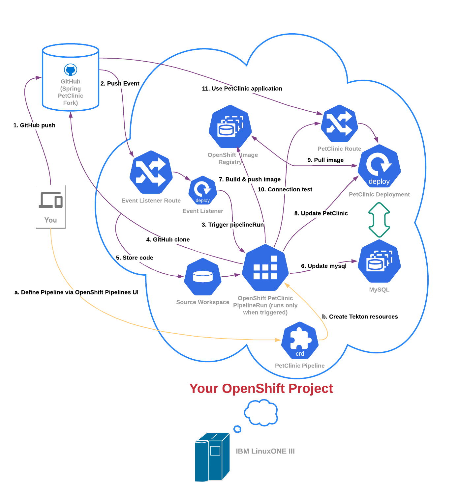

# Cloud Native Workshop Introduction
You will build and deploy an application (the cloud native way) using OpenShift Container Platform and its CI/CD workflow OpenShift Pipelines.

## Lab Overview
You will set up a virtual pet clinic (based on the classic spring boot demo referenced in the main [documentation](https://projects.spring.io/spring-petclinic/){target="_blank" rel="noopener noreferrer"}) running on LinuxONE using source code on GitHub and OpenShift Pipelines to seamlessly update, test, and deploy your pet clinic.

### Lab Parts

This lab is broken into three main parts:

1. Building and deploying the PetClinic Java application with OpenShift Pipelines

2. Configuring PetClinic's integration and deployment pipeline to meet your organization's needs[^1]

3. Promoting PetClinic from development to staging with testing and GitHub integration (adding the C [continuous] in CI/CD)

### Bonus Part

1. Securing your pipeline with SonarQube to put the Sec in DevSecOps

### Architecture Overview

Throughout your journey across the three main parts listed above, you will slowly construct the following architecture:

#### Define your Pipeline Flow (orange lines in picture above)

a. Interact with the OpenShift Pipelines UI to define your pipeline and other Tekton components.

b. OpenShift Pipelines UI creates the resources you defined in your OpenShift project

#### Run your Pipeline Flow (purple lines in picture above)

1. git push changes to your code to to GitHub
2. The GitHub webhook sends a push event to the event listener URL
3. The event listener triggers a new pipeline run based on the `PipelineRunTemplate` and parameters populated from GitHub
4. git clone the newly updated code from GitHub
5. store this code in a persistent Tekton workspace. Use this workspace to store data and changes during pipeline runs
6. make sure mysql is up to date with definition in GitHub
7. build container image with newly updated code (testing it during the build) and then push the image
8. update the PetClinic application with the new image tag and other dev or test parameters as well as any changes to Kubernetes definitions
9. pull newest PetClinic container image to deploy code changes
10. test external connection via route
11. use PetClinic from your web browser to test out the updated code, including new features added.

!!! Note
    The pipeline completes Steps 8-10 first for the development environment. Once they complete, the pipeline will tear down that environment and repeat steps 8-10 for the staging environment, before moving on to step 11.

[^1]: For the purposes of this lab, you are fulfilling the requirements of a fictional organization. These requirements could change for your specific organization but would follow a similar pattern with different specifics.