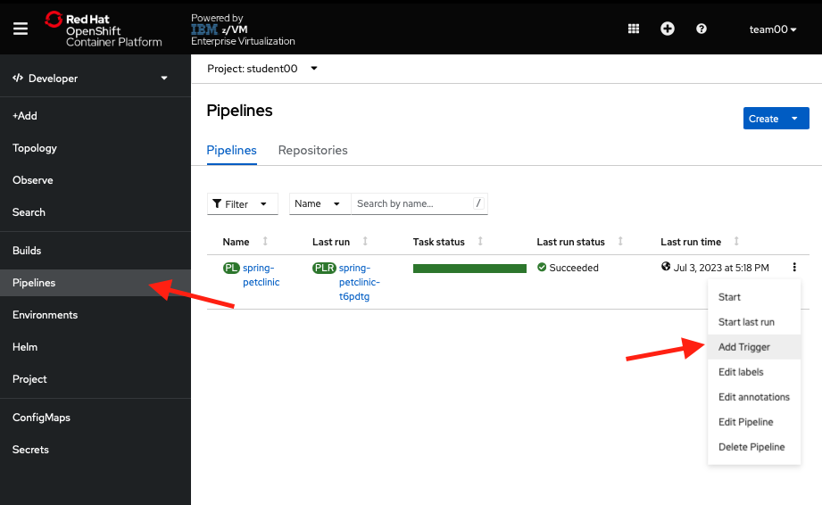
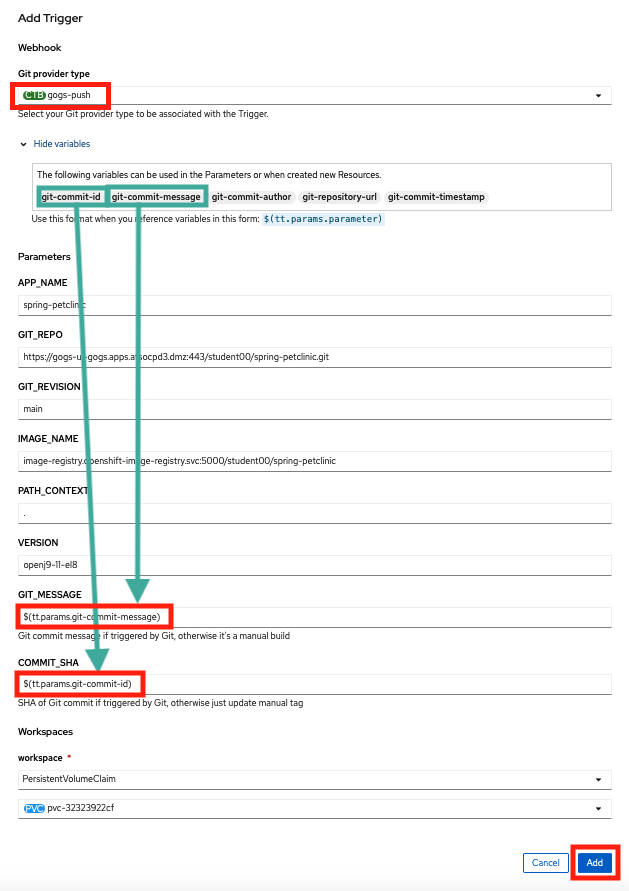
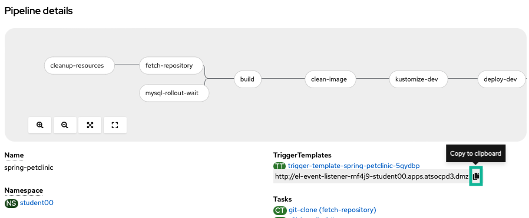
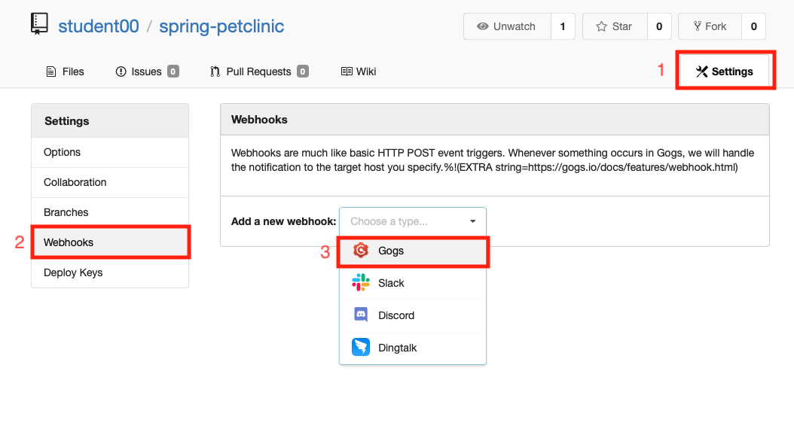
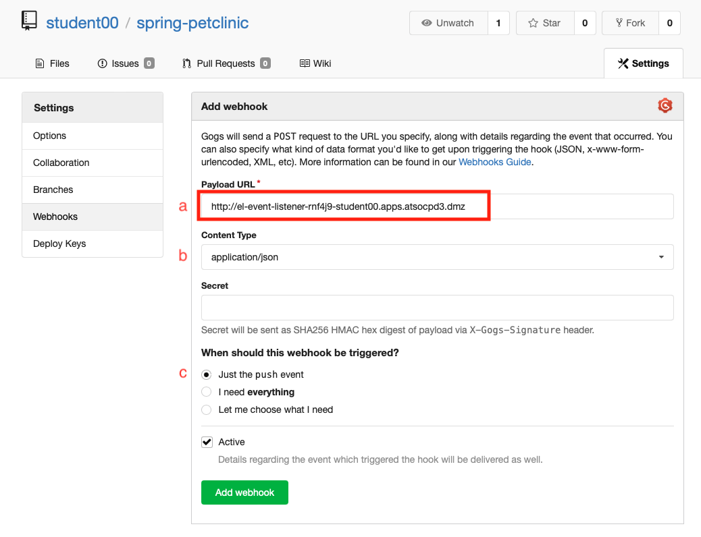
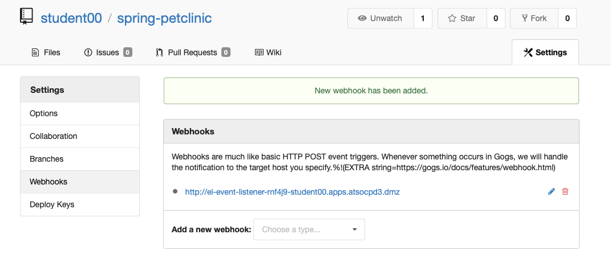

# Integrating OpenShift Pipelines with Gogs

It's time to add the `C` (continuous) to your CI/CD pipeline.

## Add a Gogs Trigger

1. Choose `Add Trigger` from the pipeline menu

    

2. Configure the trigger as follows (copy and paste boxes below image) and click `Add` to add the trigger to your pipeline:

    

    !!! note
        The `Git_Repo` parameter should have your student instead of `student00`. This should already be correctly filled out for you, so please don't change that to `student00`.

    ``` bash title="Git Provider Type"
    gogs-push
    ```

    !!! note
        `gogs-push` is in a menu you need to select from

    ``` bash title="GIT_MESSAGE"
    $(tt.params.git-commit-message)
    ```

    ``` bash title="COMMIT_SHA"
    $(tt.params.git-commit-id)
    ```

You are choosing the `gogs-push` cluster trigger binding, which we defined for our cluster using the [webhook parameters from Gogs](https://gogs.io/docs/features/webhook){target="_blank" rel="noopener"}. This passes information into a number of different variables which you can list by clicking the expand arrow seen in the picture (It will initially say `Show Variables` and then switch to `Hide Variables` when expanded as shown in the picture). You will be using the variables in green boxes in the picture to pass the git commit message (`git-commit-message`) as well as the SHA (id) of the git commit (`git-commit-id`) to the build pipeline from the Gogs webhook that triggers the build.

## Setting up Git Webhook

Now, you need to set up a webhook from Gogs. You want this to hit your `event listener`, the pipelines resource which listens for events from outside sources in order to trigger a build. The listener you set up is using the `gogs-push` trigger binding to trigger a new pipeline run for your `spring-petclinic` pipeline passing the `gogs-push` parameters mentioned before. You created this `event-listener` via the OpenShift Pipelines UI when you added a trigger and will see it in the `Topology` section of the OpenShift UI as another application when you travel back there later. In order to setup your webhook to send a message to the `event listener` after a git push, do the following:

1. Find the event listener url from the `Details` view of your pipeline and copy it using the copy button

    

    Find the value listed for **your** pipeline and copy that value.

2. Navigate to **your** git repository of the `spring-petclinic` application.

    !!! Tip
        Your git repository should be in the form `https://gogs-ui-gogs.apps.atsocpd3.dmz/`**yourstudent**`/spring-petclinic` where **yourstudent** is **your** lab student such as `https://gogs-ui-gogs.apps.atsocpd3.dmz/student00/spring-petclinic` for **student00**.

3. Go to the `settings` page of the repository and add a `Gogs` webhook

	

4. Go to the Webhooks section and add a webhook with: 

    1. `event listener URL` as the `PAYLOAD_URL`
    
    2. `application/json` selected as the `Content type`
    
    3. `Just the push event` selected for `Which events would you like to trigger this webhook?`.

    

5. See the successfully created webhook now listed

    

## Summary :full_moon:

You created a Gogs webhook for your `spring-petclinic` repository that will trigger a new run of your `spring-petclinic` pipeline when new code is pushed to your Gogs repo[^1]. You will trigger your pipeline via Gogs in the next section.

[^1]: A more detailed explanation is that when new code is pushed to your Gogs repo, the Gogs webhook will send a payload to the event listener which then interacts with a number of OpenShift Pipelines-associated Kubernetes custom resources that you created when you used the `Add Trigger` button in the UI. Namely, the event listener will trigger a new `PipelineRun` of your `spring-petclinic` pipeline based on the `spring-petclinic` `TriggerTemplate` passing it the values for the git commit SHA hash and the commit message using the variables populated via the `gogs-push` `ClusterTriggerBinding`.