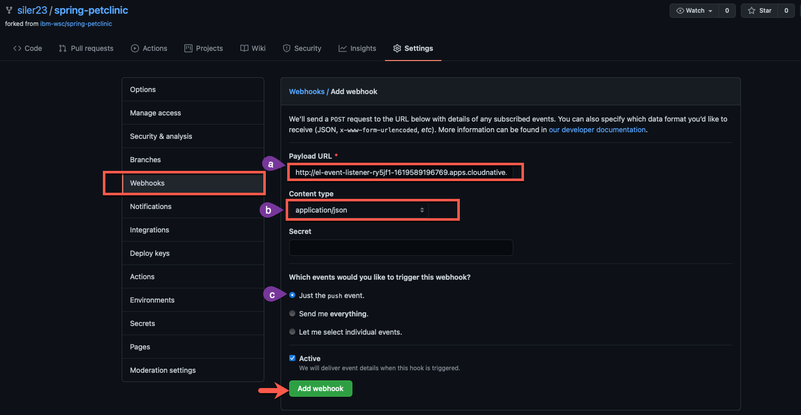

# Integrating OpenShift Pipelines with GitHub

It's time to add the `C` (continuous) to your CI/CD pipeline.

## Add a GitHub Trigger

1. Choose `Add Trigger` from the pipeline menu

    

2. Configure the trigger as follows (copy and paste boxes below image) and click `Add` to add the trigger to your pipeline:

    

    !!! note
        The `Git_Repo` parameter should have your GitHub username instead of `siler23`. This should already be correctly filled out for you, so please don't change that to `siler23`.

    ``` bash title="Git Provider Type"
    github-push
    ```

    !!! note
        `github-push` is in a menu you need to select from

    ``` bash title="GIT_MESSAGE"
    $(tt.params.git-commit-message)
    ```

    ``` bash title="COMMIT_SHA"
    $(tt.params.git-commit-id)
    ```

You are choosing the `github-push` cluster trigger binding, which is defined out of the box for OpenShift Pipelines. This passes information into a number of different variables which you can list by clicking the expand arrow seen in the picture (It will initially say `Show Variables` and then switch to `Hide Variables` when expanded as shown in the picture). You will be using the variables in green boxes in the picture to pass the git commit message (`git-commit-message`) as well as the SHA of the git commit (`git-revision`) to the build pipeline from the GitHub webhook that triggers the build.

## Setting up Git Webhook

Now, you need to set up a webhook from GitHub. You want this to hit your `event listener`, the pipelines resource which listens for events from outside sources in order to trigger a build. The listener you set up is using the `github-push` trigger binding to trigger a new pipeline run for your `spring-petclinic` pipeline passing the `github-push` parameters mentioned before. You created this `event-listener` via the OpenShift Pipelines UI when you added a trigger and will see it in the `Topology` section of the OpenShift UI as another application when you travel back there later. In order to setup your webhook to send a message to the `event listener` after a git push, do the following:

1. Get the event listener url from the `Details` view of your pipeline

    

    Find the value listed for **your** pipeline and copy that value.

2. Navigate to **your** git fork of the `github.com/ibm-wsc/spring-petclinic` GitHub repository

    !!! Tip
        Your git fork should be in the form github.com/**yourusername**/spring-petclinic where **yourusername** is **your** GitHub username

3. Go to the `settings` page of the repository

4. Go to the Webhooks section and add a webhook with: 

    1. `event listener URL` as the `PAYLOAD_URL`
    
    2. `application/json` selected as the `Content type`
    
    3. `Just the push event` selected for `Which events would you like to trigger this webhook?`.

    

5. See the successfully created webhook now listed

    

## Summary :full_moon:

You created a GitHub webhook for your `spring-petclinic` repository fork that will trigger a new run of your `spring-petclinic` pipeline when new code is pushed to your GitHub repo[^1]. You will trigger your pipeline via GitHub in the next section.

[^1]: A more detailed explanation is that when new code is pushed to your GitHub repo, the GitHub webhook will send a payload to the event listener which then interacts with a number of OpenShift Pipelines-associated Kubernetes custom resources that you created when you used the `Add Trigger` button in the UI. Namely, the event listener will trigger a new `PipelineRun` of your `spring-petclinic` pipeline based on the `spring-petclinic` `TriggerTemplate` passing it the values for the git commit SHA hash and the commit message using the variables populated via the `github-push` `ClusterTriggerBinding`.