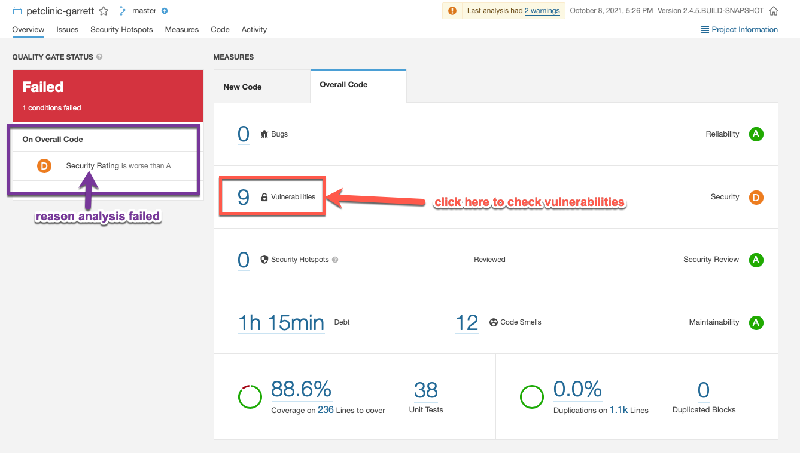
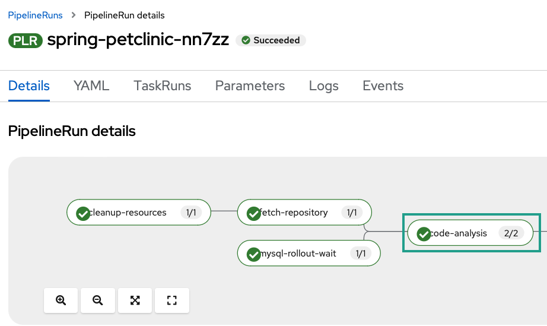

# Configure SonarQube code analysis in your Pipeline

As a bonus lab, you will now configure an extra task in your existing Pipeline to conduct code scanning on your petclinic source code. This exercise is to show you one way of incorporating security code scanning as part of your automated CI/CD pipeline.

We will use the popular open source package SonarQube to do the code scanning. According to Wikipedia, "SonarQube is an open-source platform developed by SonarSource for continuous inspection of code quality to perform automatic reviews with static analysis of code to detect bugs, code smells, and security vulnerabilities on 20+ programming languages."

For Petclinic, we will be using SonarScanner for Maven. The ability to execute the SonarQube analysis via a regular Maven goal makes it available anywhere Maven is available (developer build, CI server, etc.), without the need to manually download, setup, and maintain a SonarQube Runner installation. For more information on SonarScanner for Maven, please see [here](https://docs.sonarqube.org/latest/analysis/scan/sonarscanner-for-maven/){target="_blank" rel="noopener"}.

## Configuring maven-settings with the Sonar scanner plugin

We need to configure maven with the Sonar scanner plugin prefix. We will do that by including the sonar scanner plugin in the maven settings file.

We will create a Kubernetes ConfigMap for the mavens settings file.

Click on the Import Yaml button at the top of the OpenShift console (the '+' symbol).

Copy and paste the entirety of the following into the editor and then hit "Create" (copy by clicking on the copy icon in the top right of the box below).

```bash
kind: ConfigMap
apiVersion: v1
metadata:
  name: maven-settings
data:
  settings.xml: |
    <?xml version="1.0" encoding="UTF-8"?>
    <settings>
      <pluginGroups>
        <pluginGroup>io.spring.javaformat</pluginGroup>
        <pluginGroup>org.sonarsource.scanner.maven</pluginGroup>
      </pluginGroups>
      <profiles>
        <profile>
          <id>sonar</id>
          <activation>
            <activeByDefault>true</activeByDefault>
          </activation>
          <properties>
            <!-- Wait until the quality check is complete in SonarQube  -->
            <sonar.qualitygate.wait>
              true
            </sonar.qualitygate.wait>
            <!-- Exclude DTO Files from SonarQube duplication check as these should have duplications -->
            <sonar.cpd.exclusions>
              **/*DTO*
            </sonar.cpd.exclusions>
          </properties>
        </profile>
      </profiles>
    </settings>
```

## Accessing the SonarQube server with your assigned credentials

The lab instructors have already setup a SonarQube server within the OpenShift cluster for you to access for code scanning. Credentials have also been setup for you. Please use your assigned credentials to test access to the SonarQube Server.

1. Access the SonarQube server [here](https://sonarqube-sonarqube.apps.atsocpd3.dmz){target="_blank" rel="noopener"}

2. Select `Log in` in the upper right hand corner. And log in with your assigned credentials.

	!!! Failure "If you are not successful with this step"

		Please let an instructor know.

## Generate a security token for your SonarQube account

You'll need either your credentials, or an access token associated with your account, in order to access the server for code scanning. 

Let's use the access token method.

Now that you've logged in, select your account in the upper right hand corner of the SonarQube server page.

 

In the account panel, go to the security tab, and type in the name `petclinic` to help identify your token, and then select `Generate`. Now copy and save this token or leave the page/tab open to copy it when you need it in the next subsection.

 

## Configuring maven task into Pipeline to do code analysis

Go back to your OpenShift console and go to your pipeline. Your pipeline should look like the picture below, at this point of the workshop.


1. Add `maven-settings` workspace to your pipeline

	

	1. Click `Add workspace`

	2. Name the workspace

		``` bash
		maven-settings
		```

	3. Click `Save`

2. We will insert the code analysis task before the build task. The idea being we want to scan the source code for bugs and vulnerabilities, before we build a container image out of it.

    a. From your pipeline screen, Go to Actions -> Edit Pipeline.

    b. Select the plus sign before the build task, as in the picture below.

      

    c. Then search for and select the `maven` task.

      

    !!! tip
        Once you add a specific task (i.e. `maven`), clicking on the oval of the task will enable you to edit its default values for your needs.

3. Give the task the following parameters to do the code analysis with the proper maven goals set to do code scanning against our SonarQube server.

    

    ``` bash title="Display Name"
    code-analysis
    ```

    ``` bash title="MAVEN_IMAGE"
    maven:3.8.1-jdk-11-openj9
    ```

    **GOALS**

    ``` bash title="GOAL 1"
    package
    ```

    ``` bash title="GOAL 2"
    sonar:sonar
    ```

    ``` bash title="GOAL 3"
    -Dsonar.login=<use-your-token-from-previous-step>
    ```

	!!! warning "Use your token"

		You need to replace `<use-your-token-from-previous-step>` with your actual token.

    ``` bash title="GOAL 4"
    -Dsonar.host.url=http://sonarqube.sonarqube:9000
    ```

    ``` bash title="GOAL 5"
    -Dsonar.projectName=petclinic-<your-student>
    ```

	!!! warning "Use your student..."
		
		Be mindful to put your student in the value of the `Dsonar.projectName` and ``Dsonar.projectKey` goals (i.e., substitute `<your-student>` with your student such as `petclinic-student00`).

    ``` bash title="GOAL 6"
    -Dsonar.projectKey=petclinic-<your-student>
    ```

    !!! warning "...Please use your student"

        Remember to replace `<your-student>` with your student such as `petclinic-student00`.

	``` bash title="SOURCE (choose from dropdown)"
	workspace
	```

	``` bash title="MAVEN-SETTINGS (choose from dropdown)"
	maven-settings
	```

4. Now you can click away to get back to the main pipeline edit panel.

5. Save the `pipeline`.

## Add the new `maven-settings` workspace to the TriggerTemplate

1. Go to the **TriggerTemplates** section of your pipeline and click the link to take you to your pipeline's `TriggerTemplate`

    

2. Edit the `TriggerTemplate`

    1. Click Actions
    2. Choose `Edit TriggerTemplate` from the dropdown menu

    

3. Add the workspace to the `workspaces` section of the TriggerTemplate.

    1. Add the following code to the `workspaces` section

        ```
                  - name: maven-settings
                    configMap:
                      name: maven-settings
        ```
        
        !!! caution "Indentation Matters!"

            Take care to match the indentation in the picture below

    2. Click `Save` to apply your changes

    

## Run the pipeline

Go to the Actions menu of your pipeline and select Start.


Hit Start after reviewing the settings panel and making sure to set the options for the `source`(select `PersistentVolumeClaim` and your claim) and `maven-settings` ( select `configmap` as the resource choice and `maven-settings` as the specific configmap to use as in the image below) workspaces.


You can go to your pipeline logs and see the output for each of the tasks. <TO DO .. add screen shot of pipeline logs>

It will take 15-20 minutes for the code analysis to run completely through. This task will wait until the quality check is complete in SonarQube and if the quality gate fails, this task will fail and the pipeline will not continue to run. If the quality gate succeeds, this task will succeed and progress onto the next task in the pipeline.

Let's see if our code passes the code analysis...


It fails :disappointed:. Next, we are going to see why it failed.

## Analyzing the Failure in SonarQube

### View your project

At this point please return to the SonarQube server [here](https://sonarqube-sonarqube.apps.atsocpd3.dmz){target="_blank" rel="noopener"}, and view the code scan report to see what caused the quality check to fail. After logging in, please do the following:


1. Type your student in the project search bar to bring up your project

2. Click on your project (which should have a `Failed` label)

### Check what caused the failure



You can see that the overall code check failed due to a security rating worse than A. You should see 9 vulnerabilities that caused this failure. In order to check what these are, please click on the vulnerabilities link as shown in the image.


1. See individual vulnerabilities and click on `Why is this an issue?`

2. Read the vulnerability descriptions to see why they are a problem and get insights into fixing them in the code.

## Update PetClinic to fix the issues that came up in the SonarQube scan

In the scan, there were various security issues related to the use of entity objects for data transfer instead of data transfer objects (DTOs) when using @RequestMapping and similar methods. In order to fix these, you will have to make changes to the java code for the application. Luckily for you, the changes have already been made on the `security-fixes` branch of the project. In order to bring these changes to the main branch you will need to make a pul request and merge the `security-fixes` branch into the main branch. 

You can do this with the following actions:

1. Go to your petclinic repository in Gogs and create a new pull request

      

      1. Navigate to the `Files` tab of your repository

      2. Click on the green pull request button to the left of the branch

2. Choose the `security-fixes` branch to merge into the `main` branch

    

3. Write a justification for your pull request and create it

    

	1. Give your pull request a title such as:

		``` bash
		Security Fixes
		```

    2. Write a justification such as 
	
		``` bash
		Create fixes for all of the security vulnerabilities that showed up in the SonarQube scan.
		```

    3. Click `Create Pull Request`

5. Merge your pull request, merging the `security-fixes` branch with all of the security fixes into the `main` branch.

    

6. Delete the `security-fixes` branch now that it's been successfully merged into the `main` branch of your petclinic repository fork.

    

    1. See that the `security-fixes` branch was successfully merged!

    2. Click `Delete branch` to delete the now superfluous `security-fixes` branch.

## Verify that vulnerabilities in petclinic have been patched 

1. See a new pipeline triggered back in the `Pipelines` view of your OpenShift namespace.

    

2. View the pipeline run and watch it successfully complete the `code-analysis` task.

    

    !!! note
        You can also wait to see the other tasks pass but since the main goal of this section was to focus on integrating security into DevOps and you have already gone through the pipeline without the `code-analysis` task, there is really no need to do so.

3. View the [SonarQube server](https://sonarqube-1670885178028.apps.cloudnative.marist.edu/){target="_blank" rel="noopener"} again to see the updated results for your project (based on the latest scan)

    1. See your project passes and click on it for full results

        !!! tip
            Search for your project with your student like before.

        

    2. View the final results of the scan.

        

        Those pesky vulnerabilities have been squashed! :tada:

## Summary :telescope:

In this section, you started on your DevSecOps journey by integrating SonarQube security scanning into your DevOps pipeline. Initially, the scan flagged several security vulnerabilities, causing the pipeline to fail before the vulnerable code could get packaged into a container. Next, you were able to dig into the vulnerabilities and figure out what needed to be changed with the SonarQube report. Then, you applied a security patch, eliminating the flagged security vulnerabilities in the PetClinic application. With these changes, your pipeline succeeded having containerized and deployed secure code. Finally, you are left with a pipeline set up to catch any new security vulnerabilities as soon as they appear. Congratulations!
