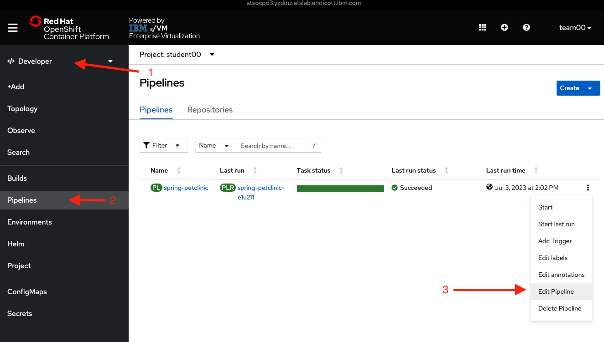
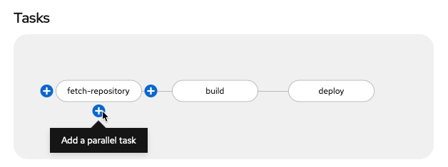
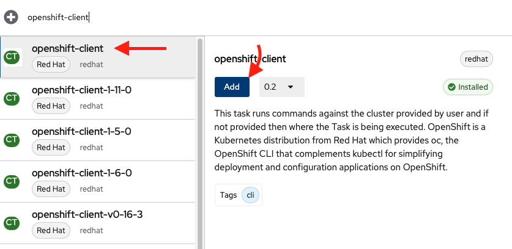
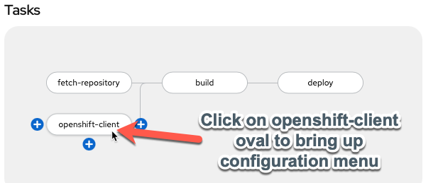
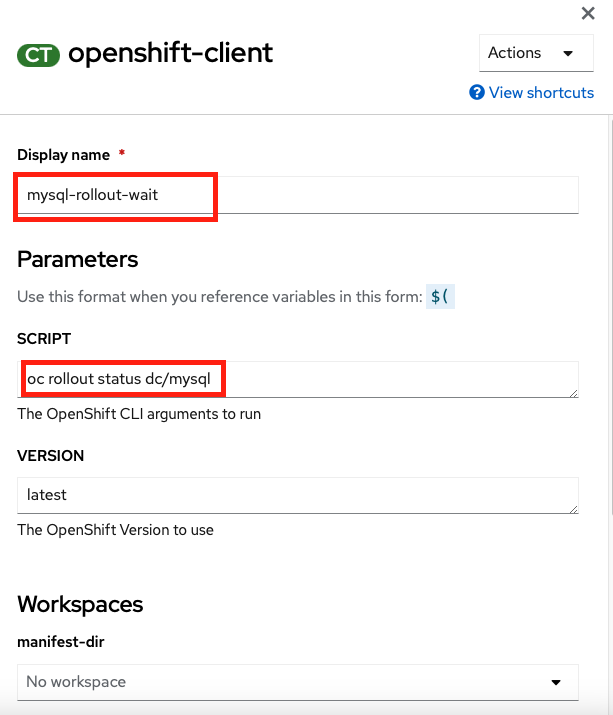
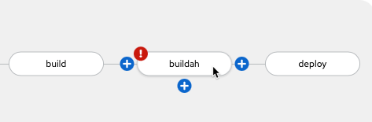
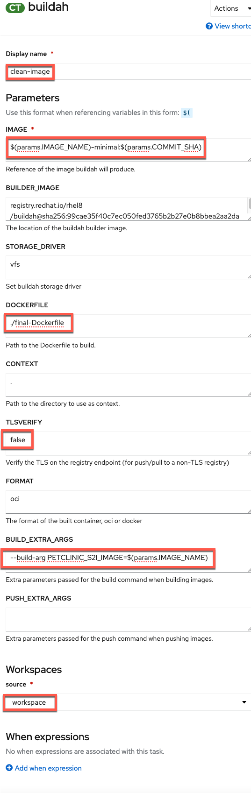
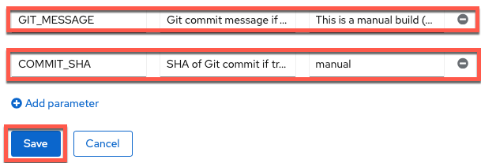

# Configure PetClinic Build and Test to Meet your Organization's Requirements[^1]

Now that PetClinic is up and running on your OpenShift cluster, it's time to add functionality to your pipeline to achieve basic integration and deployment when triggered. The OpenShift pipeline you created in the [PetClinic Up and Running](../build-and-deploy/upandrunning.md) uses [Tekton](https://tekton.dev){target="_blank" rel="noopener noreferrer"} to run a series of tasks (each with one or more steps) to accomplish a workflow (pipeline). You will use the Pipeline Builder UI built into OpenShift to quickly and easily craft a pipeline that meets your specific needs.

!!! question "Why OpenShift Pipelines?"
    - Portable: OpenShift resources defined via yaml files -> portable across OpenShift clusters

    - Low Resource Usage: Containers spin up when triggered -> resources only used when needed

    - Configurable: Can tailor overall pipeline and individual tasks to needs of your enterprise/organization 
    
    - Ease of Use: Pipeline Builder UI and built-in cluster resources (i.e. `ClusterTasks`, `ClusterTriggerBindings`, etc.) enable you to easily create a pipeline and export the yaml files with minimal knowledge

## PetClinic Pipeline

When you deployed the PetClinic application using the `From Git` option in the [PetClinic Up and Running](../build-and-deploy/upandrunning.md) section, you chose to create a basic pipeline. You'll start with this pipeline and edit it to add new functionality for your use case. 

Navigate to the `Pipelines` tab in the `Developer` perspective on the left and then click the three dots to the right of the pipeline name (`spring-petclinic`) and choose `Edit Pipeline`.  

## Ensure MySQL Database Deployed for each Run

This will bring you to the Pipeline Builder UI where you can edit your pipeline. Here you will make sure the MySQL database is configured according to your specification before the `build` task.

1. Add a `mysql-rollout-wait` task in parallel to the `git-fetch` task. 
     

    !!! question "Why is `mysql-rollout-wait` in Parallel?"
        This ensures MySQL is in place for each `PetClinic` application build (which would fail without it).  

    Click `Add Task` in the middle of the rectangle of the new task and search `openshift-client` and choose it from the menu clicking on `Add` to choose it. 

    

    Click on the middle of the oval of the `openshift-client` task to enter values for it (copy and paste boxes below image).

    

    !!! Tip
        Once you add a specific task (i.e. `openshift-client`), clicking on the oval of the task will enable you to edit its default values for your needs.

    Give the task the following parameters to ensure the MySQL database is fully rolled out:

	
    ``` bash title="Display Name"
    mysql-rollout-wait
    ```

    ``` bash title="SCRIPT"
    oc rollout status dc/mysql
    ```

    !!! note "Simply Click Away"
        Once you have entered the string into the `SCRIPT` section and deleted the help arg, just click away (i.e. on a regular section of the page) to get the configuration menu to go away and keep the new value(s) you just entered for the task.

:tada: Now your `mysql-rollout` task will make sure `MySQL` is rolled out for the `build` task!

## Make Clean Image from S2I build

The `s2i-java-11` container image is very convenient for making a container image from source code. However, the simplicity that gives it value can make it fail at meeting the needs of many organizations by itself. In your case, you will take the artifacts from the s2i container image and copy them to a new container image that can meet all your needs to get the best of both worlds. You'll create an optimized container image starting from a compact `openj9` java 11 base and employing [the advanced layers feature in spring](https://spring.io/blog/2020/01/27/creating-docker-images-with-spring-boot-2-3-0-m1#layered-jars){target="_blank" rel="noopener noreferrer"} that optimizes Docker image caching with the [final-Dockerfile](https://raw.githubusercontent.com/ibm-wsc/spring-petclinic/main/final-Dockerfile){target="_blank" rel="noopener noreferrer"} in the [ibm-wsc/spring-petclinic](https://github.com/ibm-wsc/spring-petclinic){target="_blank" rel="noopener noreferrer"} git repository you forked. 

1. Add `Buildah` task

    Add the `buildah` task as a sequential task after the `build` task.

    

2. Configure `buildah` task

    !!! Tip
        Each value that you need to configure is listed below with the value in a click-to-copy window (other values can be left alone to match the image)

    

    ``` bash title="Display Name"
    clean-image
    ```

    ``` bash title="IMAGE"
    $(params.IMAGE_NAME)-minimal:$(params.COMMIT_SHA)
    ```

    ``` bash title="DOCKERFILE"
    ./final-Dockerfile
    ```

    ``` bash title="TLSVERIFY"
    false
    ```

    ``` bash title="BUILD_EXTRA_ARGS"
    --build-arg PETCLINIC_S2I_IMAGE=$(params.IMAGE_NAME)
    ```

	``` bash title="SOURCE (choose from dropdown)"
	workspace
	```

3. Add `GIT_MESSAGE`, and `COMMIT_SHA` parameters to the pipeline

    Click `Add Parameter` twice ...

    

    and then fill in the parameter details for `GIT_MESSAGE` and `COMMIT_SHA` (copy and paste boxes below image)

    

    **GIT_MESSAGE**

    ``` title="Parameter Name"
    GIT_MESSAGE
    ```

    ``` title="Parameter Description"
    Git commit message if triggered by Git, otherwise it's a manual build
    ```

    ``` title="Parameter Default Value"
    This is a manual build (not triggered by Git)
    ```

    **COMMIT_SHA**

    ``` title="Parameter Name"
    COMMIT_SHA
    ```

    ``` title="Parameter Description"
    SHA of Git commit if triggered by Git, otherwise just update manual tag
    ```

    ``` title="Parameter Default Value"
    manual
    ```

    !!! Tip
        Save the parameters when you are done with entry by clicking on blue `Save` box before moving onto step 4. If blue `Save` box doesn't appear (is greyed out) delete extra blank parameters you may have accidentally added with the `-`.

## Summary :waxing_crescent_moon:
Your pipeline will now automatically check that your `MySQL` instance is configured properly and rolled out before moving on to the build stage (instead of doing this as a manual task like in the previous section of the lab). Moreover, it will curate the final PetClinic (`minimal`) container image to only have the necessary components instead of a bunch of extra packages (required only for the build itself) that add bloat and potential security vulnerabilities to your container image. Finally, it will tag the container image to distinguish between manual builds and those triggered by a potential git push. In the next section, you will see this automation in action for your development environment.

[^1]: For the purposes of this lab, you are fulfilling the requirements of a fictional organization. These requirements could change for your specific organization but would follow a similar pattern with different specifics.

--8<-- "includes/glossary.md"